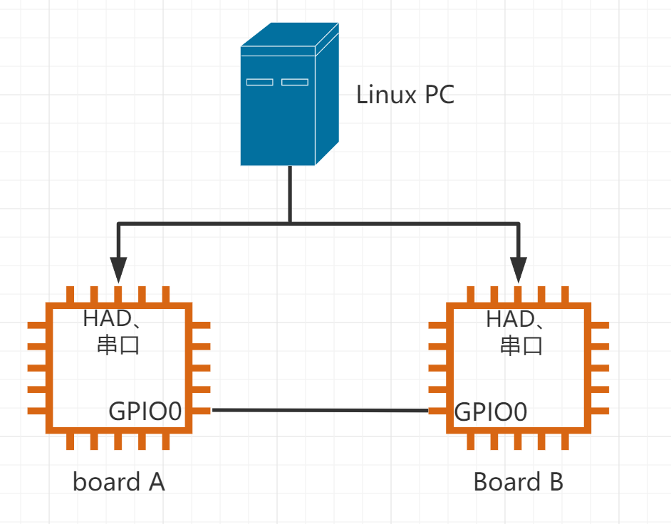

## GPIO_PIN
### 概要
该文档主要描述CSI2.0自动化测试框架下GPIO_PIN模块的AT测试命令。 文档中所涉及的命令是用来测试GPIO_PIN模块的接口工作是否正常、接口返回值是否符合预期和该模块的特性功能是否正常。
### 测试原理
PC主机用USB转串口线连接测试板（以下简称A板）和辅助测试板（以下简称B板），作为PC同A板或B板数据通信，命令收发的通道；同时PC会使用USB线连接A板和B板的HAD调试器，作为程序下载的通道；A板上被测试的GPIO通过杜邦线连接到B板的GPIO。通过PC下发AT指令到A板测试程序，发送AT指令到B板运行辅助测试程序，当A板和B板都有测试成功的信息返回PC后，PC判定本次测试执行通过。

### 测试流程
- 测试前应当连接好A板和B板之间的GPIO引脚
- 发送引脚复用的配置命令（PINMUX_CONFIG）到A板和B板，配置好需要测试的GPIO
- 发送GPIO_PIN的AT测试命令进行功能测试

### GPIO_PIN功能AT命令列表概览
以下是GPIO_PIN模块对应的AT测试命令列表及其功能简要介绍。

| AT命令列表                       | 功能简介                   |
| -------------------------------- | -------------------------- |
| AT+GPIOPIN_INTERFACE                | GPIO_PIN接口测试           |
| AT+GPIOPIN_PIN_WRITE                | 操作一个GPIO，使其输出     |
| AT+GPIOPIN_PIN_READ                 | 操作一个GPIO,使其输入      |
| AT+GPIOPIN_PIN_DEBONCE_WRITE        | 操作一个GPIO，使其防抖输出 |
| AT+GPIOPIN_DEBONCE_PIN_READ         | 操作一个GPIO，使其防抖输入 |
| AT+GPIOPIN_TOGGLE                   | 翻转GPIO的输出状态         |
| AT+GPIOPIN_PIN_TOGGLE_READ          | 读取GPIO的翻转状态         |
| AT+GPIOPIN_DEBONCE_TOGGLE           | 防抖翻转GPIO的输出状态     |
| AT+GPIOPIN_DEBONCE_PIN_TOGGLE_READ  | 读取GPIO的防抖翻转状态     |
| AT+GPIOPIN_INTERRUPT_CAPTURE        | GPIO的中断捕获             |
| AT+GPIOPIN_INTERRUPT_TRIGGER        | GPIO的中断触发             |
| AT+GPIOPIN_READ_ABNORMAL            | GPIO 输入异常测试          |
| AT+GPIOPIN_WRITE_ABNORMAL           | GPIO 输出异常测试          |
| AT+GPIOPIN_TOGGLE_ABNORMAL          | GPIO 输出状态异常测试      |

### 参数列表
以下是GPIO_PIN模块对应的AT测试命令共用参数的简要介绍。

| 参数名字      | 释义                                                    | 取值范围                                                     |
| ------------- | ------------------------------------------------------- | ------------------------------------------------------------ |
| idx           | 表示设备号，gpio_pin设备号通常为pin_name，比如0表示pin0 | 0、1、...，具体可测编号需参考soc.h                           |
| gpio_mode     | 表示gpio使用那种模式                                    | 0:GPIO_MODE_PULLNONE 1:GPIO_MODE_PULLUP 2:GPIO_MODE_PULLDOWN 3:GPIO_MODE_OPEN_DRAIN 4:GPIO_MODE_PUSH_PULL |
| pin_value     | 表示gpio的电平状态                                      | 0:低电平 1:高电平                                         |
| delay_ms      | 表示延时的时间(单位ms)                                  | 0x0 - 0xFFFF                                                 |
| gpio_irq_mode | 表示GPIO的中断模式                                      | 0:GPIO_IRQ_MODE_RISING_EDGE，上升沿 1:GPIO_IRQ_MODE_FALLING_EDGE，下降沿 2:GPIO_IRQ_MODE_BOTH_EDGE，双边沿 3:GPIO_IRQ_MODE_LOW_LEVEL，低电平 4:GPIO_IRQ_MODE_HIGH_LEVEL，高电平 |

### 命令详解

#### AT+GPIOPIN_INTERFACE

| 命令格式 | AT+GPIOPIN_INTERFACE                                         |
| -------- | ------------------------------------------------------------ |
| 命令功能 | GPIO_PIN接口异常测试。该命令测试GPIO_PIN所CSI接口的异常调用，测试时将会传入异常和非法参数，验证CSI接口是否返回相应的错误码。 |
| 示例     | 发送命令AT+GPIOPIN_INTERFACE到A板，测试完成后，A板对应串口会打印OK；否则测试失败 |

#### AT+GPIOPIN_PIN_WRITE
| 命令格式 | AT+GPIOPIN_PIN_WRITE=idx,gpio_mode,pin_value,delay_ms |
|----------------------|----------------------------------------------------------------------------------------------------------------------------------------------------------------------------------------------------------------------------|
| 命令功能 | 配置idx这个引脚为gpio_mode模式, 当配置完成后输出一个pin_value 状态的电平并维持delay_ms毫秒 |
| 可搭配的辅助测试命令 | AT+GPIOPIN_PIN_READ=idx,gpio_mode,pin_value |
| 示例 | 把A板的PA0和B板的PA1这两个引脚使用杜邦线连接, 然后按照下列步骤进行测试 步骤1:配置A板的PA0引脚作为GPIO的功能,向A板发送下列命令     AT+PINMUX_CONFIG=0,4     板子对应串口会打印OK；否则引脚配置失败 步骤2:配置B板的PA1引脚作为GPIO的功能,向B板发送下列命令     AT+PINMUX_CONFIG=1,4     板子对应串口会打印OK；否则引脚配置失败 步骤3:向A板发送测试GPIO写的命令     AT+GPIOPIN_PIN_WRITE=0,0,1,2000     测试完成后， 板子对应串口会打印OK；否则测试失败 步骤4:向B板发送GPIO读的命令     AT+GPIOPIN_PIN_READ=1,0,1     测试完成后， 板子对应串口会打印OK；否则测试失败 |
| 备注 | 由于步骤3是持续输出2秒的电平状态,所以步骤4中GPIO_PIN读的命令必须在步骤3描述的命令发出后的2秒之内发出 |

#### AT+GPIOPIN_PIN_READ
| 命令格式 | AT+GPIOPIN_PIN_READ=idx,gpio_mode,pin_value |
|----------------------|-----------------------------------------------------------------------------------------------------------------------------------------------------------------------------------|
| 命令功能 | 配置idx这个引脚为gpio_mode模式, 当配置完成后读取该引脚的输入状态值,并同pin_value做比较,如果相同则向PC机返回OK |
| 可搭配的辅助测试命令 | AT+GPIOPIN_PIN_WRITE=idx,gpio_mode,pin_value,delay_ms |
| 示例 | 参考AT+GPIOPIN_PIN_WRITE示例 |

#### AT+GPIOPIN_PIN_DEBONCE_WRITE
| 命令格式 | AT+GPIOPIN_PIN_DEBONCE_WRITE=idx,gpio_mode,pin_value,delay_ms |
|----------------------|-----------------------------------------------------------------------------------------------------------------------------------------------------------------------------------------------------------------------------------------|
| 命令功能 | 配置idx这个引脚为gpio_mode模式, 当配置完成后输出一个pin_value 状态的电平并维持delay_ms毫秒 |
| 可搭配的辅助测试命令 | AT+GPIOPIN_DEBONCE_PIN_READ=idx,gpio_mode,pin_value |
| 示例 | 把A板的PA0和B板的PA1这两个引脚使用杜邦线连接, 然后按照下列步骤进行测试 步骤1:配置A板的PA0引脚作为GPIO的功能,向A板发送下列命令     AT+PINMUX_CONFIG=0,4     板子对应串口会打印OK；否则引脚配置失败 步骤2:配置B板的PA1引脚作为GPIO的功能,向B板发送下列命令     AT+PINMUX_CONFIG=1,4     板子对应串口会打印OK；否则引脚配置失败 步骤3:向A板发送测试GPIO写的命令     AT+GPIOPIN_PIN_DEBONCE_WRITE=0,0,1,2000     测试完成后， 板子对应串口会打印OK；否则测试失败 步骤4:向B板发送GPIO读的命令     AT+GPIOPIN_DEBONCE_PIN_READ=1,0,1     测试完成后， 板子对应串口会打印OK；否则测试失败 |
| 备注 | 由于步骤3是持续输出2秒的电平状态,所以步骤4中GPIO_PIN读的命令必须在步骤3描述的命令发出后的2秒之内发出 |

#### AT+GPIOPIN_DEBONCE_PIN_READ
| 命令格式 | AT+GPIOPIN_DEBONCE_PIN_READ=idx,gpio_mode,pin_value |
|----------------------|---------------------------------------------------------------------------------------------------------------------------------------------------------------------------------------------------|
| 命令功能 | 配置idx这个引脚为gpio_mode模式, 当配置完成后读取这些引脚的输入状态值,并同pin_value做比较,如果相同则向PC机返回OK |
| 可搭配的辅助测试命令 | AT+GPIOPIN_PIN_DEBONCE_WRITE=idx,gpio_mode,pin_value,delay_ms |
| 示例 | 参考AT+GPIOPIN_PIN_DEBONCE_WRITE示例 |

#### AT+GPIOPIN_TOGGLE
| 命令格式 | AT+GPIOPIN_TOGGLE=idx,gpio_mode,pin_value,delay_ms |
|----------------------|--------------------------------------------------------------------------------------------------------------------------------------------------------------------------------------------------------------------------------------------------------|
| 命令功能 | 配置idx这个引脚为gpio_mode模式, ,当配置完成后使这些引脚翻转到pin_value 状态的电平并维持delay_ms毫秒 |
| 可搭配的辅助测试命令 | AT+GPIOPIN_PIN_TOGGLE_READ=idx,gpio_mode,pin_value |
| 示例 | 把A板的PA0和B板的PA1这两个引脚使用杜邦线连接, 然后按照下列步骤进行测试 步骤1:配置A板的PA0引脚作为GPIO的功能,向A板发送下列命令     AT+PINMUX_CONFIG=0,4     板子对应串口会打印OK；否则引脚配置失败 步骤2:配置B板的PA1引脚作为GPIO的功能,向B板发送下列命令     AT+PINMUX_CONFIG=1,4     板子对应串口会打印OK；否则引脚配置失败 步骤3:向A板发送测试GPIO写的命令     AT+GPIOPIN_TOGGLE=0,0,1,2000     测试完成后， 板子对应串口会打印OK；否则测试失败 步骤4:向B板发送GPIO读的命令     AT+GPIOPIN_PIN_TOGGLE_READ=1,0,1     测试完成后， 板子对应串口会打印OK；否则测试失败 |
| 备注 | 由于步骤3是持续输出2秒的电平状态,所以步骤4中GPIO_PIN读的命令必须在步骤3描述的命令发出后的2秒之内发出 |

#### AT+GPIOPIN_PIN_TOGGLE_READ
| 命令格式 | AT+GPIOPIN_PIN_TOGGLE_READ=idx,gpio_mode,pin_value |
|----------------------|-------------------------------------------------------------------------------------------------------------------------------------------------------------------------------------------------------------|
| 命令功能 | 配置idx这个引脚为gpio_mode模式, 当配置完成后读取引脚的值,如果都同pin_value 状态相同,则向PC机返回OK |
| 可搭配的辅助测试命令 | AT+GPIOPIN_TOGGLE=idx,gpio_mode,pin_value,delay_ms |
| 示例 | 参考AT+GPIOPIN_TOGGLE示例 |

#### AT+GPIOPIN_DEBONCE_TOGGLE

| 命令格式             | AT+GPIOPIN_DEBONCE_TOGGLE=idx,gpio_mode,pin_value,delay_ms   |
| -------------------- | ------------------------------------------------------------ |
| 命令功能             | 配置idx这个引脚为gpio_mode模式, ,当配置完成后使这些引脚翻转到pin_value 状态的电平并维持delay_ms毫秒 |
| 可搭配的辅助测试命令 | AT+GPIOPIN_DEBONCE_PIN_TOGGLE_READ=idx,gpio_mode,pin_value   |
| 示例                 | 把A板的PA0和B板的PA1这两个引脚使用杜邦线连接, 然后按照下列步骤进行测试 步骤1:配置A板的PA0引脚作为GPIO的功能,向A板发送下列命令     AT+PINMUX_CONFIG=0,4     板子对应串口会打印OK；否则引脚配置失败 步骤2:配置B板的PA1引脚作为GPIO的功能,向B板发送下列命令     AT+PINMUX_CONFIG=1,4     板子对应串口会打印OK；否则引脚配置失败 步骤3:向A板发送测试GPIO写的命令     AT+GPIOPIN_DEBONCE_TOGGLE=0,0,1,2000     测试完成后， 板子对应串口会打印OK；否则测试失败 步骤4:向B板发送GPIO读的命令     AT+GPIOPIN_DEBONCE_PIN_TOGGLE_READ=1,0,1     测试完成后， 板子对应串口会打印OK；否则测试失败 |
| 备注                 | 由于步骤3是持续输出2秒的电平状态,所以步骤4中GPIO_PIN读的命令必须在步骤3描述的命令发出后的2秒之内发出 |

#### AT+GPIOPIN_DEBONCE_PIN_TOGGLE_READ

| 命令格式             | AT+GPIOPIN_DEBONCE_PIN_TOGGLE_READ=idx,gpio_mode,pin_value   |
| -------------------- | ------------------------------------------------------------ |
| 命令功能             | 配置idx这个引脚为gpio_mode模式, 当配置完成后读取引脚的值,如果都同pin_value 状态相同,则向PC机返回OK |
| 可搭配的辅助测试命令 | AT+GPIOPIN_DEBONCE_TOGGLE=idx,gpio_mode,pin_value,delay_ms   |
| 示例                 | 参考AT+GPIOPIN_DEBONCE_TOGGLE示例                            |

#### AT+GPIOPIN_INTERRUPT_CAPTURE

| 命令格式 | AT+GPIOPIN_INTERRUPT_CAPTURE=idx,gpio_mode,gpio_irq_mode |
|----------------------|------------------------------------------------------------------------------------------------------------------------------------------------------------------|
| 命令功能 | 配置idx这个引脚为gpio_mode模式和捕获的中断为gpio_irq_mode模式 |
| 可搭配的辅助测试命令 | AT+GPIOPIN_INTERRUPT_TRIGGER=idx,gpio_mode,gpio_irq_mode,delay_ms |
| 示例 | 把A板的PA0和B板的PA1这两个引脚使用杜邦线连接, 然后按照下列步骤进行测试 步骤1:配置A板的PA0引脚作为GPIO的功能,向A板发送下列命令     AT+PINMUX_CONFIG=0,4     板子对应串口会打印OK；否则引脚配置失败 步骤2:配置B板的PA1引脚作为GPIO的功能,向B板发送下列命令     AT+PINMUX_CONFIG=1,4     板子对应串口会打印OK；否则引脚配置失败 步骤3:向A板发送GPIO捕获中断信号的命令     AT+GPIOPIN_INTERRUPT_CAPTURE=0,0,0     测试完成后， 板子对应串口会打印OK；否则测试失败 步骤4:向B板发送GPIO信号触发的命令     AT+GPIOPIN_INTERRUPT_TRIGGER=1,4,0,2000     测试完成后， 板子对应串口会打印OK；否则测试失败 |
| 备注 | 由于步骤4是延时2秒后输出信号,所以步骤3中GPIO_PIN捕获中断的命令必须在步骤4描述的命令发出后的2秒之内发出 |

#### AT+GPIOPIN_INTERRUPT_TRIGGER
| 命令格式 | AT+GPIOPIN_INTERRUPT_TRIGGER=idx,gpio_mode,gpio_irq_mode,delay_ms |
|----------------------|------------------------------------------------------------------------------------------------------------------------------------------------------------------|
| 命令功能 | 配置idx这个引脚为gpio_mode模式,并在配置完成延时delay_ms毫秒后,产生gpio_irq_mode中断模式所需的信号 |
| 可搭配的辅助测试命令 | AT+GPIOPIN_INTERRUPT_CAPTURE=idx,gpio_mode,gpio_irq_mode |
| 示例 | 参考AT+GPIOPIN_INTERRUPT_CAPTURE示例 |