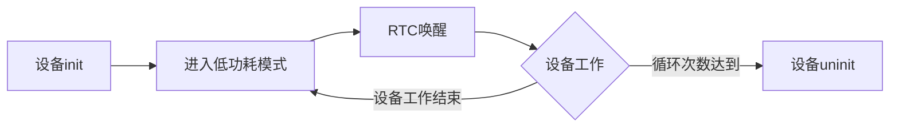
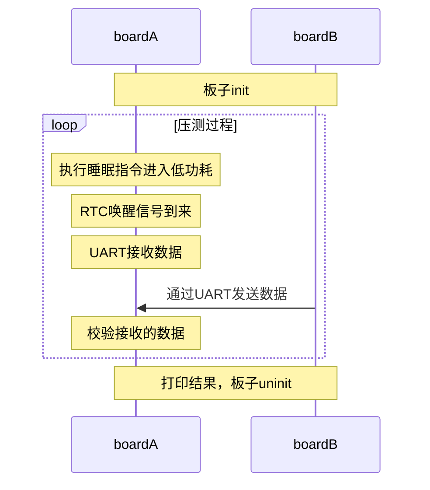
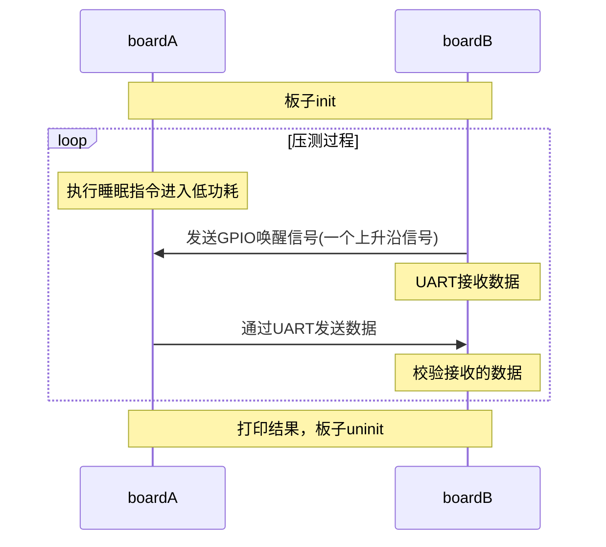
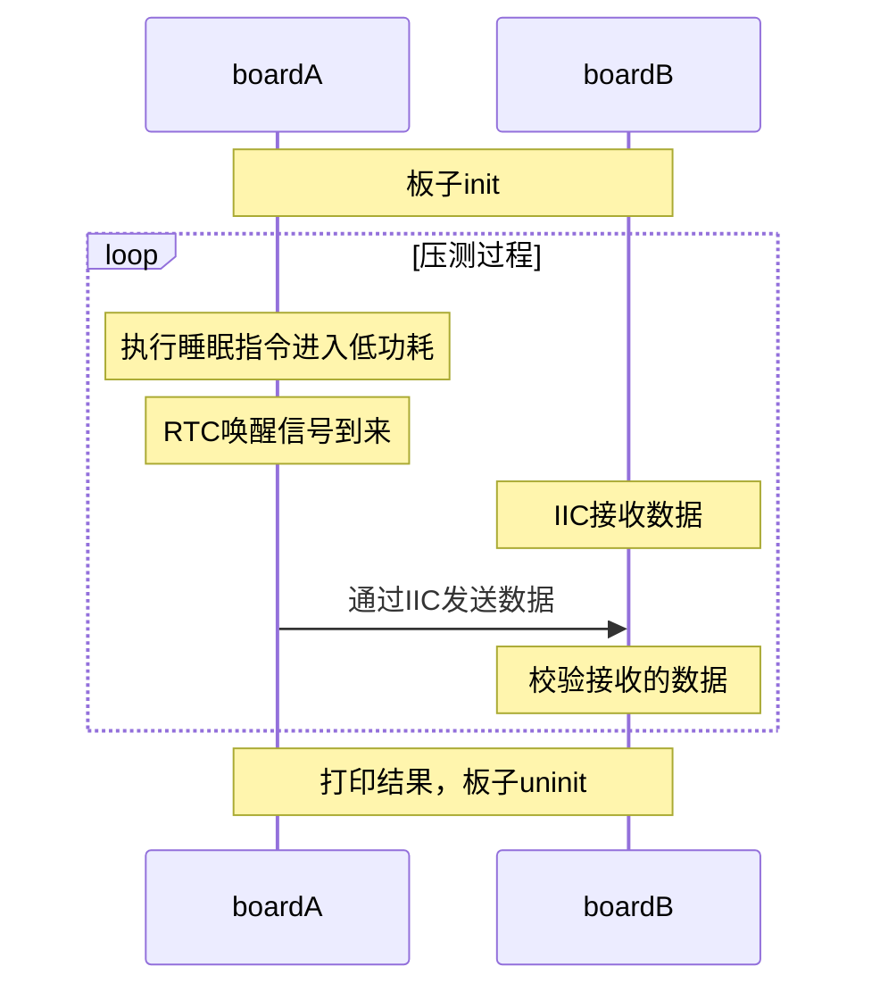
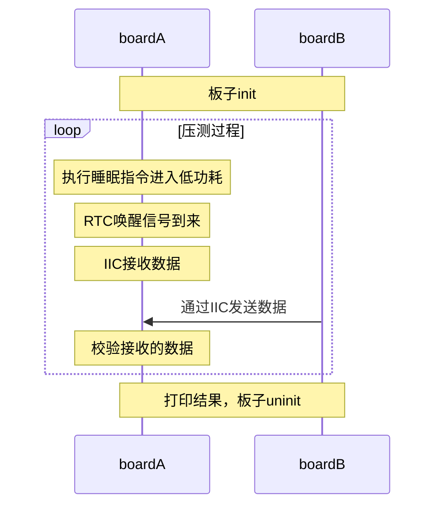
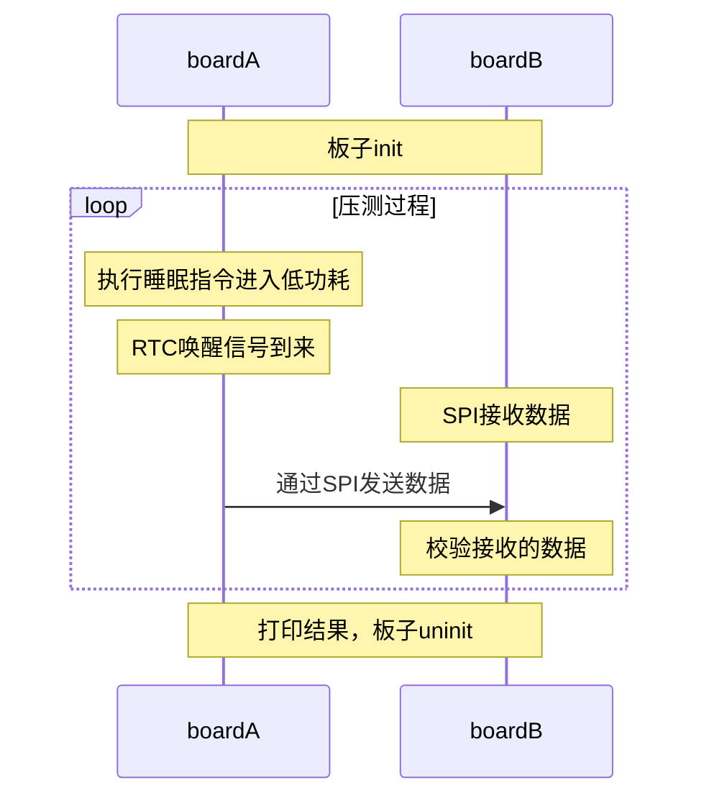
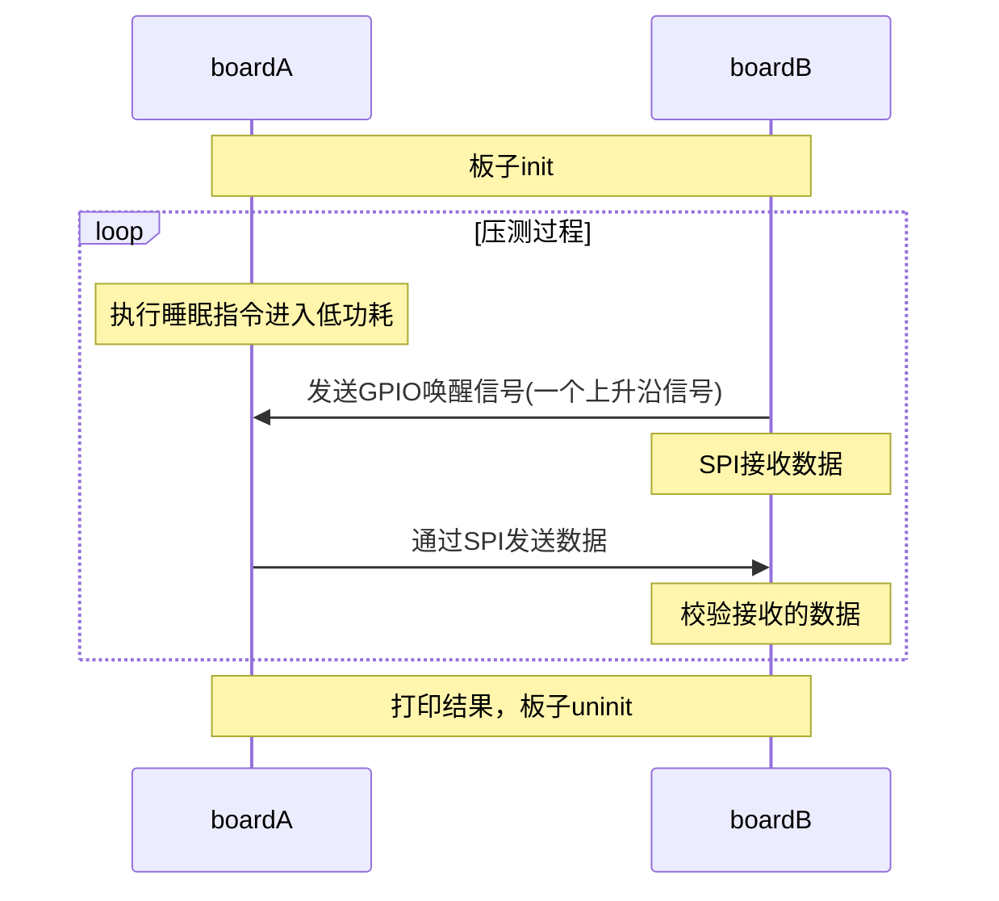
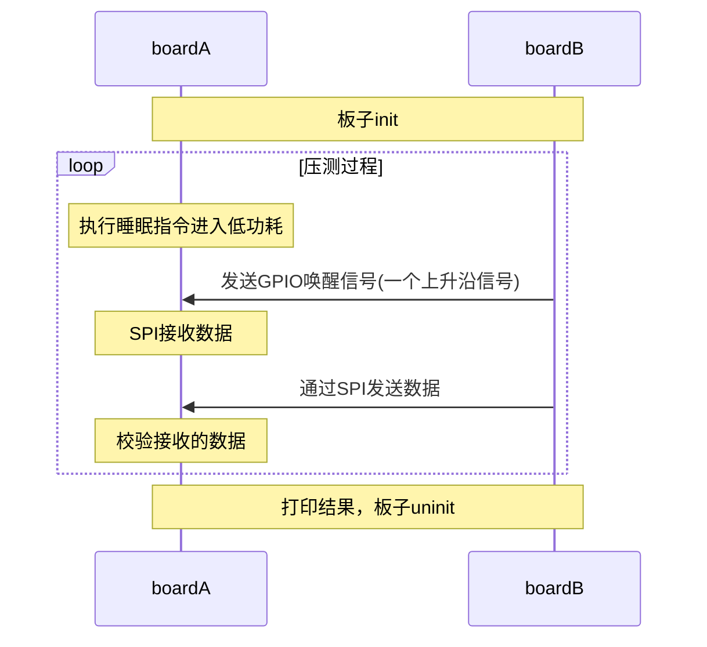

## pmu_stress_user_guide
### 简介
该文档描述PMU模块压测的实现方法和实现的压测命令。

### 测试流程
PMU的压力测试测试流程如下：

### AT命令列表 
以下是PMU模块对应的测试命令列表及其功能简要介绍。

| AT命令列表    | 测试功能        |
| ------------- | ---------------- |
| STRESS_PMU_UART_SRWU | PMU使芯片进入睡眠，RTC唤醒后，UART进行发送 |
| STRESS_PMU_UART_RRWU | PMU使芯片进入睡眠，RTC唤醒后，UART进行接收 |
| STRESS_PMU_IIC_SRWU | PMU使芯片进入睡眠，RTC唤醒后，IIC进行发送 |
| STRESS_PMU_IIC_RRWU | PMU使芯片进入睡眠，RTC唤醒后，IIC进行接收 |
| STRESS_PMU_SPI_SRWU | PMU使芯片进入睡眠，RTC唤醒后，SPI进行发送 |
| STRESS_PMU_SPI_RRWU | PMU使芯片进入睡眠，RTC唤醒后，SPI进行接收 |
| STRESS_PMU_UART_SGWU | PMU使芯片进入睡眠，GPIO唤醒后，UART进行发送 |
| STRESS_PMU_UART_RGWU | PMU使芯片进入睡眠，GPIO唤醒后，UART进行接收 |
| STRESS_PMU_IIC_SGWU | PMU使芯片进入睡眠，GPIO唤醒后，IIC进行发送 |
| STRESS_PMU_IIC_RGWU | PMU使芯片进入睡眠，GPIO唤醒后，IIC进行接收 |
| STRESS_PMU_SPI_SGWU | PMU使芯片进入睡眠，GPIO唤醒后，SPI进行发送 |
| STRESS_PMU_SPI_RGWU | PMU使芯片进入睡眠，GPIO唤醒后，SPI进行接收 |

### 测试用例使用介绍
#### STRESS_PMU_UART_SRWU
##### 测试原理

##### 环境搭建
1. 把csi-test库代码放入SDK包的根目录，进入test_tools目录下，执行python3 ./build.py STRESS_PMU ../ rhino 编译测试镜像
2. 准备两块开发板，测试板为A板，辅助测试板为B板，把两块板之间需要测试的UART用杜邦线连接
3. 把A板和B板的默认打印串口连接到PC的串口终端

##### 测试执行
1. 把测试镜像加载到A板和B版上运行起来，串口终端出现 BOOT_INT 表示可以向A板和B板发送测试命令
2. 向A板和B板发送配置引脚功能配置<参考文档 PIN.md>的命令，配置测试的UART的功能脚
3. 向B板发送命令AT+STRESS_PMU_UART_R=...
4. 向A板发送命令AT+STRESS_PMU_UART_SRWU=...

##### 测试结果
测试结束后，A板和B板的打印串口均显示OK

#### STRESS_PMU_UART_RRWU
##### 测试原理

##### 环境搭建
1. 把csi-test库代码放入SDK包的根目录，进入test_tools目录下，执行python3 ./build.py STRESS_PMU ../ rhino 编译测试镜像
2. 准备两块开发板，测试板为A板，辅助测试板为B板，把两块板之间需要测试的UART用杜邦线连接
3. 把A板和B板的默认打印串口连接到PC的串口终端

##### 测试执行
1. 把测试镜像加载到A板和B版上运行起来，串口终端出现 BOOT_INT 表示可以向A板和B板发送测试命令
2. 向A板和B板发送配置引脚功能配置<参考文档 PIN.md>的命令，配置测试的UART的功能脚
3. 向A板发送命令AT+STRESS_PMU_UART_RRWU=...
4. 向B板发送命令AT+STRESS_PMU_UART_S=...

##### 测试结果
测试结束后，A板和B板的打印串口均显示OK

#### STRESS_PMU_UART_SGWU
##### 测试原理

##### 环境搭建
1. 把csi-test库代码放入SDK包的根目录，进入test_tools目录下，执行python3 ./build.py STRESS_PMU ../ rhino 编译测试镜像
2. 准备两块开发板，测试板为A板，辅助测试板为B板，把两块板之间需要测试的UART用杜邦线连接，用作唤醒源的GPIO使用杜邦线连接
3. 把A板和B板的默认打印串口连接到PC的串口终端

##### 测试执行
1. 把测试镜像加载到A板和B版上运行起来，串口终端出现 BOOT_INT 表示可以向A板和B板发送测试命令
2. 向A板和B板发送配置引脚功能配置<参考文档 PIN.md>的命令，配置测试的UART的功能脚，和唤醒通道GPIO的功能脚
3. 向B板发送命令AT+STRESS_PMU_UART_RWS=...
4. 向A板发送命令AT+STRESS_PMU_UART_SRWU=...

##### 测试结果
测试结束后，A板和B板的打印串口均显示OK

#### STRESS_PMU_UART_RGWU
##### 测试原理

##### 环境搭建
1. 把csi-test库代码放入SDK包的根目录，进入test_tools目录下，执行python3 ./build.py STRESS_PMU ../ rhino 编译测试镜像
2. 准备两块开发板，测试板为A板，辅助测试板为B板，把两块板之间需要测试的UART用杜邦线连接，用作唤醒源的GPIO使用杜邦线连接
3. 把A板和B板的默认打印串口连接到PC的串口终端

##### 测试执行
1. 把测试镜像加载到A板和B版上运行起来，串口终端出现 BOOT_INT 表示可以向A板和B板发送测试命令
2. 向A板和B板发送配置引脚功能配置<参考文档 PIN.md>的命令，配置测试的UART的功能脚和唤醒通道GPIO的功能脚
3. 向A板发送命令AT+STRESS_PMU_UART_RRWU=...
4. 向B板发送命令AT+STRESS_PMU_UART_SWS=...

##### 测试结果
测试结束后，A板和B板的打印串口均显示OK

#### STRESS_PMU_IIC_SRWU
##### 测试原理

##### 环境搭建
1. 把csi-test库代码放入SDK包的根目录，进入test_tools目录下，执行python3 ./build.py STRESS_PMU ../ rhino 编译测试镜像
2. 准备两块开发板，测试板为A板，辅助测试板为B板，把两块板之间需要测试的UART用杜邦线连接
3. 把A板和B板的默认打印串口连接到PC的串口终端

##### 测试执行
1. 把测试镜像加载到A板和B版上运行起来，串口终端出现 BOOT_INT 表示可以向A板和B板发送测试命令
2. 向A板和B板发送配置引脚功能配置<参考文档 PIN.md>的命令，配置测试的IIC的功能脚
3. 向B板发送命令AT+STRESS_PMU_IIC_R=...
4. 向A板发送命令AT+STRESS_PMU_IIC_SRWU=...

##### 测试结果
测试结束后，A板和B板的打印串口均显示OK

#### STRESS_PMU_IIC_RRWU
##### 测试原理

##### 环境搭建
1. 把csi-test库代码放入SDK包的根目录，进入test_tools目录下，执行python3 ./build.py STRESS_PMU ../ rhino 编译测试镜像
2. 准备两块开发板，测试板为A板，辅助测试板为B板，把两块板之间需要测试的IIC用杜邦线连接
3. 把A板和B板的默认打印串口连接到PC的串口终端

##### 测试执行
1. 把测试镜像加载到A板和B版上运行起来，串口终端出现 BOOT_INT 表示可以向A板和B板发送测试命令
2. 向A板和B板发送配置引脚功能配置<参考文档 PIN.md>的命令，配置测试的UART的功能脚
3. 向A板发送命令AT+STRESS_PMU_IIC_RRWU=...
4. 向B板发送命令AT+STRESS_PMU_IIC_S=...

##### 测试结果
测试结束后，A板和B板的打印串口均显示OK

#### STRESS_PMU_IIC_SGWU
##### 测试原理

##### 环境搭建
1. 把csi-test库代码放入SDK包的根目录，进入test_tools目录下，执行python3 ./build.py STRESS_PMU ../ rhino 编译测试镜像
2. 准备两块开发板，测试板为A板，辅助测试板为B板，把两块板之间需要测试的IIC用杜邦线连接，用作唤醒源的GPIO使用杜邦线连接
3. 把A板和B板的默认打印串口连接到PC的串口终端

##### 测试执行
1. 把测试镜像加载到A板和B版上运行起来，串口终端出现 BOOT_INT 表示可以向A板和B板发送测试命令
2. 向A板和B板发送配置引脚功能配置<参考文档 PIN.md>的命令，配置测试的IIC的功能脚，和唤醒通道GPIO的功能脚
3. 向B板发送命令AT+STRESS_PMU_IIC_RWS=...
4. 向A板发送命令AT+STRESS_PMU_IIC_SRWU=...

##### 测试结果
测试结束后，A板和B板的打印串口均显示OK

#### STRESS_PMU_IIC_RGWU
##### 测试原理

##### 环境搭建
1. 把csi-test库代码放入SDK包的根目录，进入test_tools目录下，执行python3 ./build.py STRESS_PMU ../ rhino 编译测试镜像
2. 准备两块开发板，测试板为A板，辅助测试板为B板，把两块板之间需要测试的UART用杜邦线连接，用作唤醒源的GPIO使用杜邦线连接
3. 把A板和B板的默认打印串口连接到PC的串口终端

##### 测试执行
1. 把测试镜像加载到A板和B版上运行起来，串口终端出现 BOOT_INT 表示可以向A板和B板发送测试命令
2. 向A板和B板发送配置引脚功能配置<参考文档 PIN.md>的命令，配置测试的UART的功能脚和唤醒通道GPIO的功能脚
3. 向A板发送命令AT+STRESS_PMU_UART_RRWU=...
4. 向B板发送命令AT+STRESS_PMU_UART_SWS=...

##### 测试结果
测试结束后，A板和B板的打印串口均显示OK

#### STRESS_PMU_SPI_SRWU
##### 测试原理

##### 环境搭建
1. 把csi-test库代码放入SDK包的根目录，进入test_tools目录下，执行python3 ./build.py STRESS_PMU ../ rhino 编译测试镜像
2. 准备两块开发板，测试板为A板，辅助测试板为B板，把两块板之间需要测试的SPI用杜邦线连接
3. 把A板和B板的默认打印串口连接到PC的串口终端

##### 测试执行
1. 把测试镜像加载到A板和B版上运行起来，串口终端出现 BOOT_INT 表示可以向A板和B板发送测试命令
2. 向A板和B板发送配置引脚功能配置<参考文档 PIN.md>的命令，配置测试的UART的功能脚
3. 向B板发送命令AT+STRESS_PMU_SPI_R=...
4. 向A板发送命令AT+STRESS_PMU_SPI_SRWU=...

##### 测试结果
测试结束后，A板和B板的打印串口均显示OK

#### STRESS_PMU_SPI_RRWU
##### 测试原理

##### 环境搭建
1. 把csi-test库代码放入SDK包的根目录，进入test_tools目录下，执行python3 ./build.py STRESS_PMU ../ rhino 编译测试镜像
2. 准备两块开发板，测试板为A板，辅助测试板为B板，把两块板之间需要测试的SPI用杜邦线连接
3. 把A板和B板的默认打印串口连接到PC的串口终端

##### 测试执行
1. 把测试镜像加载到A板和B版上运行起来，串口终端出现 BOOT_INT 表示可以向A板和B板发送测试命令
2. 向A板和B板发送配置引脚功能配置<参考文档 PIN.md>的命令，配置测试的SPI的功能脚
3. 向A板发送命令AT+STRESS_PMU_SPI_RRWU=...
4. 向B板发送命令AT+STRESS_PMU_SPI_S=...

##### 测试结果
测试结束后，A板和B板的打印串口均显示OK

#### STRESS_PMU_SPI_SGWU
##### 测试原理

##### 环境搭建
1. 把csi-test库代码放入SDK包的根目录，进入test_tools目录下，执行python3 ./build.py STRESS_PMU ../ rhino 编译测试镜像
2. 准备两块开发板，测试板为A板，辅助测试板为B板，把两块板之间需要测试的SPI用杜邦线连接，用作唤醒源的GPIO使用杜邦线连接
3. 把A板和B板的默认打印串口连接到PC的串口终端

##### 测试执行
1. 把测试镜像加载到A板和B版上运行起来，串口终端出现 BOOT_INT 表示可以向A板和B板发送测试命令
2. 向A板和B板发送配置引脚功能配置<参考文档 PIN.md>的命令，配置测试的SPI的功能脚，和唤醒通道GPIO的功能脚
3. 向B板发送命令AT+STRESS_PMU_SPI_RWS=...
4. 向A板发送命令AT+STRESS_PMU_SPI_SRWU=...

##### 测试结果
测试结束后，A板和B板的打印串口均显示OK

#### STRESS_PMU_SPI_RGWU
##### 测试原理

##### 环境搭建
1. 把csi-test库代码放入SDK包的根目录，进入test_tools目录下，执行python3 ./build.py STRESS_PMU ../ rhino 编译测试镜像
2. 准备两块开发板，测试板为A板，辅助测试板为B板，把两块板之间需要测试的SPI用杜邦线连接，用作唤醒源的GPIO使用杜邦线连接
3. 把A板和B板的默认打印串口连接到PC的串口终端

##### 测试执行
1. 把测试镜像加载到A板和B版上运行起来，串口终端出现 BOOT_INT 表示可以向A板和B板发送测试命令
2. 向A板和B板发送配置引脚功能配置<参考文档 PIN.md>的命令，配置测试的SPI的功能脚和唤醒通道GPIO的功能脚
3. 向A板发送命令AT+STRESS_PMU_SPI_RRWU=...
4. 向B板发送命令AT+STRESS_PMU_SPI_SWS=...

##### 测试结果
测试结束后，A板和B板的打印串口均显示OK

#### 测试命令解释
##### PMU+UART
<table>
    <tr>
        <td>命令格式</td><td>命令功能</td>
    </tr>
    <tr>
        <td>AT+STRESS_PMU_UART_SRWU=dev_idx,baud,data_bits,parity,stop_bits,trans_size,test_times,wakeup_src_num</td>
        <td>PMU使芯片进入睡眠，RTC唤醒后，UART进行发送</td>
    </tr>
    <tr>
        <td>AT+STRESS_PMU_UART_R=dev_idx,baud,data_bits,parity,stop_bits,trans_size,test_times</td>
        <td>操作UART接收数据，并对数据的正确性作校验</td>
    </tr>
    <tr>
        <td>AT+STRESS_PMU_UART_RRWU=dev_idx,baud,data_bits,parity,stop_bits,trans_size,test_times,wakeup_src_num</td>
        <td>PMU使芯片进入睡眠，RTC唤醒后，UART进行接收</td>
    </tr>
    <tr>
        <td>AT+STRESS_PMU_UART_S=dev_idx,baud,data_bits,parity,stop_bits,trans_size,test_times</td>
        <td>操作UART每间隔10s发送一次数据</td>
    </tr>
    <tr>
        <td>AT+STRESS_PMU_UART_SGWU=dev_idx,baud,data_bits,parity,stop_bits,trans_size,test_times,wakeup_src_num,gpio_port_idx,pin</td>
        <td>PMU使芯片进入睡眠，GPIO唤醒后，UART进行发送</td>
    </tr>
    <tr>
        <td>AT+STRESS_PMU_UART_RWS=dev_idx,baud,data_bits,parity,stop_bits,trans_size,test_times,gpio_port_idx,pin</td>
        <td>先发送一个上升沿唤醒信号，再操作UART接收数据，并对数据的正确性作校验</td>
    </tr>
    <tr>
        <td>AT+STRESS_PMU_UART_RGWU=dev_idx,baud,data_bits,parity,stop_bits,trans_size,test_times,wakeup_src_num,gpio_port_idx,pin</td>
        <td>PMU使芯片进入睡眠，GPIO唤醒后，UART进行接收</td>
    </tr>
    <tr>
        <td>AT+STRESS_PMU_UART_SWS=dev_idx,baud,data_bits,parity,stop_bits,trans_size,test_times,gpio_port_idx,pin</td>
        <td>先发送一个上升沿唤醒信号，再操作UART发送一次数据</td>
    </tr>
</table>

<table>
    <tr>
        <td>参数名</td>
        <td>释义</td>
        <td>取值范围</td>
    </tr>
    <tr>
        <td>dev_idx</td>
        <td>uart的索引号</td>
        <td>0 ~ 0xFF</td>
    </tr>
    <tr>
        <td>baud</td>
        <td>波特率</td>
        <td>0 ~ 0xFFFFFFFF</td>
    </tr>
    <tr>
        <td>data_bits</td>
        <td>数据位</td>
        <td>0: 5位数据位; 1: 6位数据位 2: 7位 3: 8位 4: 9位</td>
    </tr>
    <tr>
        <td>parity</td>
        <td>奇偶校验位</td>
        <td>0: 无校验 1: 偶校验 2: 奇校验</td>
    </tr>
    <tr>
        <td>stop_bits</td>
        <td>停止位</td>
        <td>0: 1位停止位 1: 2位 2: 1.5位</td>
    </tr>
    <tr>
        <td>trans_size</td>
        <td>传输的字节数</td>
        <td>0 ~ 0xFFFFFFFF</td>
    </tr>
    <tr>
        <td>test_times</td>
        <td>测试循环的次数</td>
        <td>0 ~ 0xFFFFFFFF</td>
    </tr>
    <tr>
        <td>wakeup_src_num</td>
        <td>低功耗唤醒源编号</td>
        <td>0 ~ 0xFF,参考芯片SDK包中soc.h文件的wakeupn_type_t</td>
    </tr>
    <tr>
        <td>gpio_port_idx</td>
        <td>gpio port索引</td>
        <td>0 ~ 0xFF,参考芯片soc手册</td>
    </tr>
    <tr>
        <td>pin</td>
        <td>低功耗唤醒使用的引脚</td>
        <td>0x1: 表示gpio0, 0x2: 表示gpio1, 0x80000000: 表示gpio31</td>
    </tr>
</table>

##### PMU+IIC
<table>
    <tr>
        <td>命令格式</td><td>命令功能</td>
    </tr>
    <tr>
        <td>AT+STRESS_PMU_IIC_SRWU=dev_idx,addr_mode,dev_mode,own_addr,slave_addr,speed,trans_size,test_times,wakeup_src_num</td>
        <td>PMU使芯片进入睡眠，RTC唤醒后，IIC进行发送</td>
    </tr>
    <tr>
        <td>AT+STRESS_PMU_IIC_R=dev_idx,addr_mode,dev_mode,own_addr,slave_addr,speed,trans_size,test_times</td>
        <td>操作IIC接收数据，并对数据的正确性作校验</td>
    </tr>
    <tr>
        <td>AT+STRESS_PMU_IIC_RRWU=dev_idx,addr_mode,dev_mode,own_addr,slave_addr,speed,trans_size,test_times,wakeup_src_num</td>
        <td>PMU使芯片进入睡眠，RTC唤醒后，IIC进行接收</td>
    </tr>
    <tr>
        <td>AT+STRESS_PMU_IIC_S=dev_idx,addr_mode,dev_mode,own_addr,slave_addr,speed,trans_size,test_times</td>
        <td>操作IIC每间隔10s发送一次数据</td>
    </tr>
    <tr>
        <td>AT+STRESS_PMU_IIC_SGWU=dev_idx,addr_mode,dev_mode,own_addr,slave_addr,speed,trans_size,test_times,wakeup_src_num,gpio_port_idx,pin</td>
        <td>PMU使芯片进入睡眠，GPIO唤醒后，IIC进行发送</td>
    </tr>
    <tr>
        <td>AT+STRESS_PMU_IIC_RWS=dev_idx,addr_mode,dev_mode,own_addr,slave_addr,speed,trans_size,test_times,gpio_port_idx,pin</td>
        <td>先发送一个GPIO上升沿唤醒信号，再操作IIC接收数据，并对数据的正确性作校验</td>
    </tr>
    <tr>
        <td>AT+STRESS_PMU_IIC_RGWU=dev_idx,addr_mode,dev_mode,own_addr,slave_addr,speed,trans_size,test_times,wakeup_src_num,gpio_port_idx,pin</td>
        <td>PMU使芯片进入睡眠，GPIO唤醒后，IIC进行接收</td>
    </tr>
    <tr>
        <td>AT+STRESS_PMU_IIC_SWS=dev_idx,addr_mode,dev_mode,own_addr,slave_addr,speed,trans_size,test_times,gpio_port_idx,pin</td>
        <td>先发送一个GPIO上升沿唤醒信号，再操作IIC发送一次数据</td>
    </tr>
</table>

<table>
    <tr>
        <td>参数名</td>
        <td>释义</td>
        <td>取值范围</td>
    </tr>
    <tr>
        <td>dev_idx</td>
        <td>IIC的索引号</td>
        <td>0 ~ 0xFF</td>
    </tr>
    <tr>
        <td>addr_mode</td>
        <td>寻址模式</td>
        <td>0: 7位地址模式 1: 10位地址模式</td>
    </tr>
    <tr>
        <td>dev_mode</td>
        <td>设备的主从模式配置</td>
        <td>0: master模式; 1: slave模式</td>
    </tr>
    <tr>
        <td>own_addr</td>
        <td>设置自己的地址</td>
        <td>0 ~ 0xFFFFFFFF</td>
    </tr>
    <tr>
        <td>slave_addr</td>
        <td>指定与之通信的从设备的地址</td>
        <td>0 ~ 0xFFFFFFFF</td>
    </tr>
    <tr>
        <td>speed</td>
        <td>设备运行的速率</td>
        <td>0: Standard Speed (<=100kHz) 1: Fast Speed (<=400kHz) 2: Fast plus Speed (<=  1MHz) 3: High Speed (<=3.4MHz)</td>
    </tr>
    <tr>
        <td>trans_size</td>
        <td>传输的字节数</td>
        <td>0 ~ 0xFFFFFFFF</td>
    </tr>
    <tr>
        <td>test_times</td>
        <td>测试循环的次数</td>
        <td>0 ~ 0xFFFFFFFF</td>
    </tr>
    <tr>
        <td>wakeup_src_num</td>
        <td>低功耗唤醒源编号</td>
        <td>0 ~ 0xFF,参考芯片SDK包中soc.h文件的wakeupn_type_t</td>
    </tr>
    <tr>
        <td>gpio_port_idx</td>
        <td>gpio port索引</td>
        <td>0 ~ 0xFF,参考芯片soc手册</td>
    </tr>
    <tr>
        <td>pin</td>
        <td>低功耗唤醒使用的引脚</td>
        <td>0x1: 表示gpio0, 0x2: 表示gpio1, 0x80000000: 表示gpio31</td>
    </tr>
</table>

##### PMU+SPI
<table>
    <tr>
        <td>命令格式</td><td>命令功能</td>
    </tr>
    <tr>
        <td>AT+STRESS_PMU_SPI_SRWU=dev_idx,baud,format,frame_length,mode,trans_size,test_times,wakeup_src_num</td>
        <td>PMU使芯片进入睡眠，RTC唤醒后，SPI进行发送</td>
    </tr>
    <tr>
        <td>AT+STRESS_PMU_SPI_R=dev_idx,baud,format,frame_length,mode,trans_size,test_times</td>
        <td>操作SPI接收数据，并对数据的正确性作校验</td>
    </tr>
    <tr>
        <td>AT+STRESS_PMU_SPI_RRWU=dev_idx,baud,format,frame_length,mode,trans_size,test_times,wakeup_src_num</td>
        <td>PMU使芯片进入睡眠，RTC唤醒后，SPI进行接收</td>
    </tr>
    <tr>
        <td>AT+STRESS_PMU_SPI_S=dev_idx,baud,format,frame_length,mode,trans_size,test_times</td>
        <td>操作SPI每间隔10s发送一次数据</td>
    </tr>
    <tr>
        <td>AT+STRESS_PMU_SPI_SGWU=dev_idx,baud,format,frame_length,mode,trans_size,test_times,wakeup_src_num,gpio_port_idx,pin</td>
        <td>PMU使芯片进入睡眠，GPIO唤醒后，SPI进行发送</td>
    </tr>
    <tr>
        <td>AT+STRESS_PMU_SPI_RWS=dev_idx,baud,format,frame_length,mode,trans_size,test_times,gpio_port_idx,pin</td>
        <td>先发送一个GPIO上升沿唤醒信号，再操作SPI接收数据，并对数据的正确性作校验</td>
    </tr>
    <tr>
        <td>AT+STRESS_PMU_SPI_RGWU=dev_idx,baud,format,frame_length,mode,trans_size,test_times,wakeup_src_num,gpio_port_idx,pin</td>
        <td>PMU使芯片进入睡眠，GPIO唤醒后，SPI进行接收</td>
    </tr>
    <tr>
        <td>AT+STRESS_PMU_SPI_SWS=dev_idx,baud,format,frame_length,mode,trans_size,test_times,gpio_port_idx,pin</td>
        <td>先发送一个GPIO上升沿唤醒信号，再操作SPI发送一次数据</td>
    </tr>
</table>

<table>
    <tr>
        <td>参数名</td>
        <td>释义</td>
        <td>取值范围</td>
    </tr>
    <tr>
        <td>dev_idx</td>
        <td>SPI的索引号</td>
        <td>0 ~ 0xFF</td>
    </tr>
    <tr>
        <td>baud</td>
        <td>波特率</td>
        <td>0 ~ 0xFFFFFFFF</td>
    </tr>
    <tr>
        <td>format</td>
        <td>SPI总线的格式</td>
        <td>0: Clock Polarity 0, Clock Phase 0; 1: Clock Polarity 0, Clock Phase 1 2: Clock Polarity 1, Clock Phase 0 3: Clock Polarity 1, Clock Phase 1</td>
    </tr>
    <tr>
        <td>frame_length</td>
        <td>一帧数据的长度</td>
        <td>0 ~ 16, 4表示一帧数据有4位, 16表示一整数据有16位</td>
    </tr>
    <tr>
        <td>mode</td>
        <td>设备用作master还是slave</td>
        <td>0: master模式 1: slave模式</td>
    </tr>
    <tr>
        <td>trans_size</td>
        <td>传输的字节数</td>
        <td>0 ~ 0xFFFFFFFF</td>
    </tr>
    <tr>
        <td>test_times</td>
        <td>测试循环的次数</td>
        <td>0 ~ 0xFFFFFFFF</td>
    </tr>
    <tr>
        <td>wakeup_src_num</td>
        <td>低功耗唤醒源编号</td>
        <td>0 ~ 0xFF,参考芯片SDK包中soc.h文件的wakeupn_type_t</td>
    </tr>
    <tr>
        <td>gpio_port_idx</td>
        <td>gpio port索引</td>
        <td>0 ~ 0xFF,参考芯片soc手册</td>
    </tr>
    <tr>
        <td>pin</td>
        <td>低功耗唤醒使用的引脚</td>
        <td>0x1: 表示gpio0, 0x2: 表示gpio1, 0x80000000: 表示gpio31</td>
    </tr>
</table>