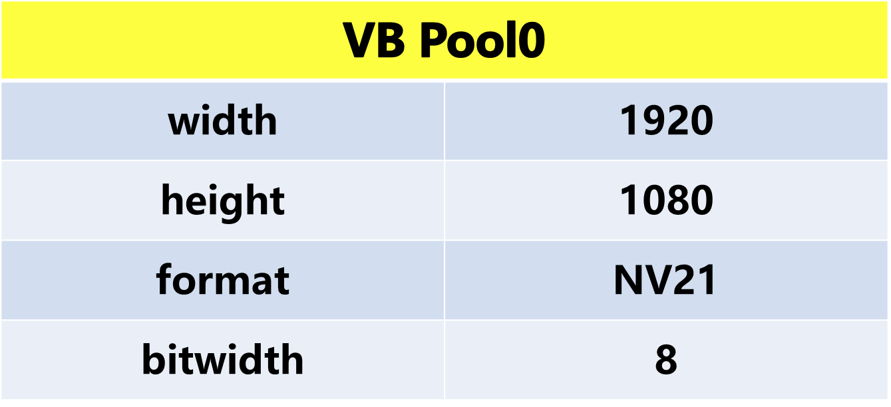
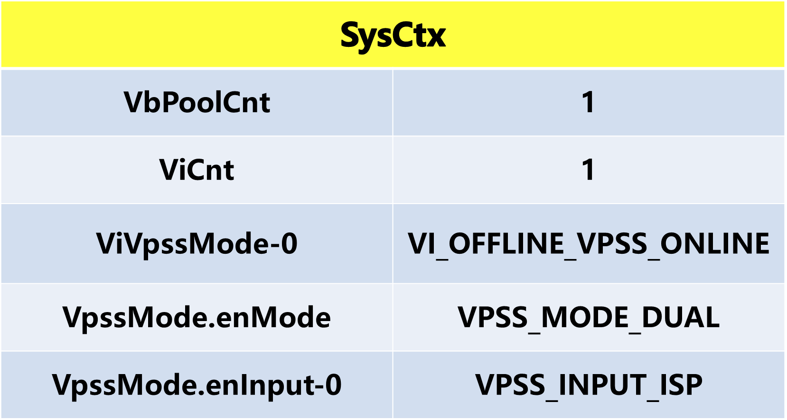
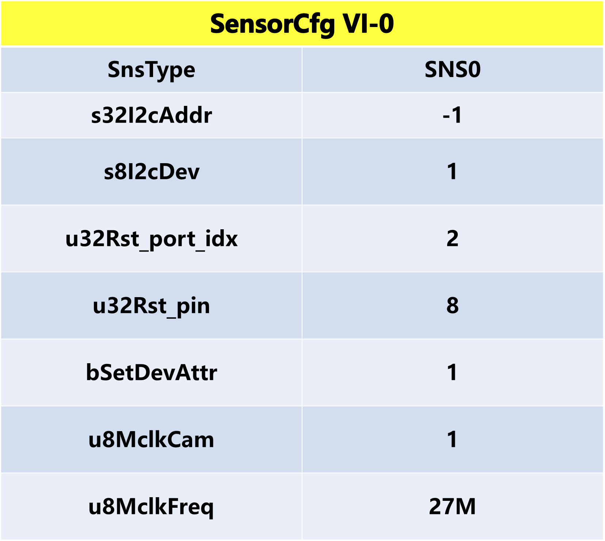

# [SmartDoorbell] turnkey_qfn

- 该方案作为 CV180X 处理器单目 sensor RGB UVC 出流参考
- 用户可结合场景使用需求进行自定义功能配置
   

## Platform

**Board：**  CV180ZB-WEVB-0008A

**Sensor：** SC2336P
 

## Pipeline

 

## YAML Config Intro

该部分仅涉及对重点功能宏 `def_config` 的说明

<!-- 详细 Project YAML 功能宏说明请参考 [Yaml Intro](yaml_intro_project.md) -->

| Name                          | Description              | Default Value |
| ----------------------------- | ------------------------ | :-----------: |
| CONFIG_SENSOR_SMS_SC2336P     | SC2336P 驱动支持          |       1       |
| CONFIG_SNS0_TYPE              | VI-SNS0 类型配置         |       21       |
| CONFIG_APP_RTSP_SUPPORT       | RTSP 视频出流方式支持    |       0       |
| CONFIG_USB_BULK_UVC           | UVC 模式选择（Iso/Bulk） |       0       |
| CONFIG_USB_DWC2_DMA_ENABLE    | USB DMA 功能支持         |       1       |
| CONFIG_USBD_UVC               | USB UVC 功能支持         |       1       |
| CONFIG_USBD_UAC               | USB UAC 功能支持         |       1       |
| CONFIG_USBD_CDC_RNDIS         | USB RNDIS 功能支持       |       0       |
| CONFIG_USBD_WINUSB            | USB WINUSB 功能支持      |       0       |
| CONFIG_APP_ETHERNET_SUPPORT   | Ethernet 功能支持        |       0       |
| CONFIG_PQTOOL_SUPPORT         | Pqtool 图像调优工具支持  |       1       |

> SNS_TYPE 依据 cvi_sns_ctrl.h 确定 sensor 序列号
>
> RNDIS 功能基于 FIFO 实现，与 DMA 功能不兼容
>
> PQTOOL 功能和 RTSP 功能基于 IP 网络与上位机通信，依赖于 RNDIS 或 ETHERNET
>  

## Param Intro

### sysparam

SYS 模块详细说明请参考 [_CVI 系统控制_](https://doc.sophgo.com/cvitek-develop-docs/master/docs_latest_release/CV180x_CV181x/zh/01.software/MPI/Media_Processing_Software_Development_Reference/build/html/3_System_Control.html)

**VBpool**

依据图像格式可确认该 VB Pool 需申请内存空间大小为:

$1920 * 1080 * 1.5 * 8 ≈ 17.8MB$

> 在内存足够的情况下，可取最大的 VB Block 大小建立公共区块池；
>
> 若需要优化内存使用，建议结合 Pipeline 配置多个不同 VB Block 大小的公共区块池

**SysCtx**

> CV180xb 由于 ViCnt 只有一个，所以这里将 VPSS 设备与 VI ISP 直连
>
> DUAL mode 下 VPSS 被视为 2 组 INPUT 使用，此时 VPSS DEV-0 只支持 1 组通道输出，VPSS DEV-1 支持 3 组通道输出
>
> SINGLE mode 下 VPSS 被视为 1 组 INPUT 使用，此时 VPSS DEV-0 支持 4 组通道输出

 

### viparam

VI 模块详细说明请参考 [_CVI 视频输入_](https://doc.sophgo.com/cvitek-develop-docs/master/docs_latest_release/CV180x_CV181x/zh/01.software/MPI/Media_Processing_Software_Development_Reference/build/html/4_Video_Input.html)

**SensorCfg**

SensorCfg 配置需结合实际电路原理图信息进行配置

该参数配置集覆盖 sensor 驱动的默认配置（sensor 驱动位于`components/cvi_sensor`目录下）

> 若需对`lane_id`与`pn_swap`进行客制化配置，在结构体初始化列表中将`bSetDevAttrMipi`置 1，并结合实际场景修改`as16LaneId`和`as8PNSwap`配置

**IspCfg**

该配置决定 sensor 加载的 ISP 参数

Pqtool 工具的使用及 ISP 参数导出可见 [_CviAlios Pqtool 使用指南_](pqtool_manual.md)

 

### vpssparam

VPSS 模块详细说明请参考 [_CVI 视频处理子系统_](https://doc.sophgo.com/cvitek-develop-docs/master/docs_latest_release/CV180x_CV181x/zh/01.software/MPI/Media_Processing_Software_Development_Reference/build/html/6_Video_Processing_Subsystem.html)

**VpssGrpCfg**

该部分仅对部分重点参数进行说明

| Name                | Description              |
| ------------------- | ------------------------ |
| VpssGrp             | Grp 编号                 |
| ChnCnt              | Grp 通道数量             |
| ViRotation          | Vi 输入图像旋转角度      |
| BindVidev           | Grp 连接的 Vi 设备编号   |
| VpssGrpAttr.VpssDev     | 使用的 Vpss 硬件设备编号 |
| VpssGrpAttr.PixelFormat | Vi 输入图像像素格式      |
| BindMode            | 绑定模式                 |
| Chn[0]              | Grp 输入通道配置         |
| Chn[1]              | Grp 输出通道配置         |
| VpssGrpCropInfo     | 组裁剪配置               |

> 各 Vpss Grp 分时复用 Vpss 硬件设备，Grp 配置上限为 16 个
>
> 当 VPSS 为 OFFLINE 模式时，BindMode 需设置为 true
>
> 当 VPSS 为 ONLINE 模式时，最多只能有两组 Grp 分别接收 VI 模块两个 sensor 来的数据

**VpssChnCfg**

该部分仅对部分重点参数进行说明

| Name                | Description           |
| ------------------- | --------------------- |
| Rotation            | Vpss Chn 图像旋转角度 |
| VpssChnAttr         | Vpss 通道属性配置     |
| ChnAttr.Width       | Chn 输出图像宽度      |
| ChnAttr.Height      | Chn 输出图像高度      |
| ChnAttr.PixelFormat | Chn 输出图像像素格式  |
| ChnAttr.Flip        | Chn 输出图像翻转配置  |
| ChnAttr.Mirror      | Chn 输出图像镜像配置  |
| ChnAttr.AspectRatio | Chn 输出图像缩放配置  |
| VpssChnCropInfo     | 通道裁剪配置          |

 

### vencparam
VENC 模块详细说明请参考 [_CVI 视频编码_](https://doc.sophgo.com/cvitek-develop-docs/master/docs_latest_release/CV180x_CV181x/zh/01.software/MPI/Media_Processing_Software_Development_Reference/build/html/7_Video_Encoding.html)

该部分对编码进行处理，RTSP出流依赖于此配置；UVC出流配置更新依据上位机请求报文，更新逻辑可参考`usbd_uvc.c`代码文件中`uvc_media_update`函数

当前UVC支持出流格式：
- YUY2
- MJPEG
- H264
- H265

 

## Src Intro

### custom_platform

该模块用于平台相关的引脚功能配置
- _UsbPinmux：USB模块引脚GPIO功能配置
- _UsbIoInit：USB模块Host Control/Device Control功能选择
- _MipiRxPinmux： MIPI RX引脚功能配置
- _MipiTxPinmux： MIPI TX引脚功能配置
- _SensorPinmux：Sensor相关引脚功能配置
  - I2C引脚配置
  - RESET引脚配置
  - MCLK引脚配置

 

### custom_event

该模块可用于用户自定义功能接口调用

 

<!-- ### custom_misc

  -->
