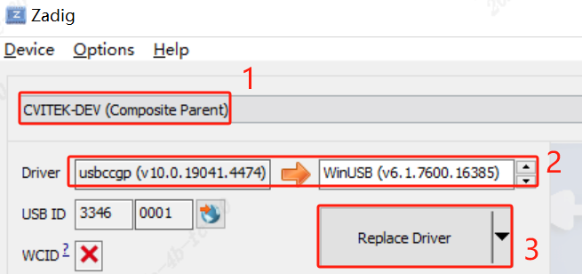
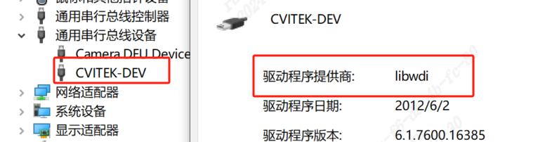
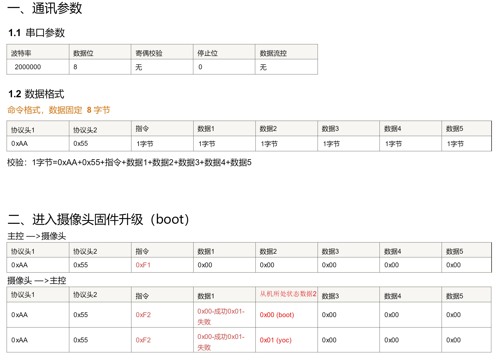
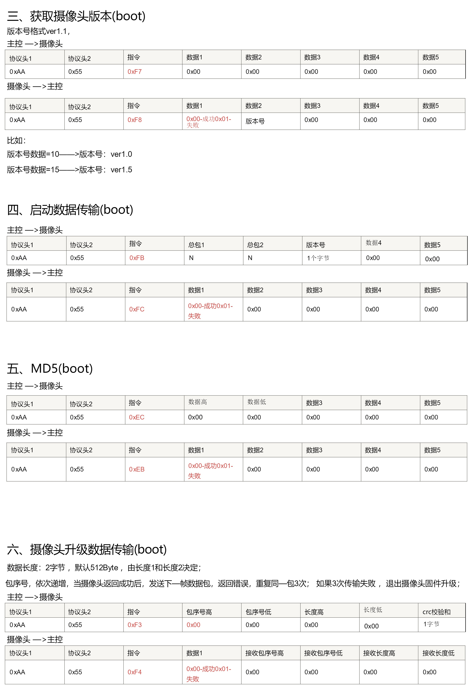
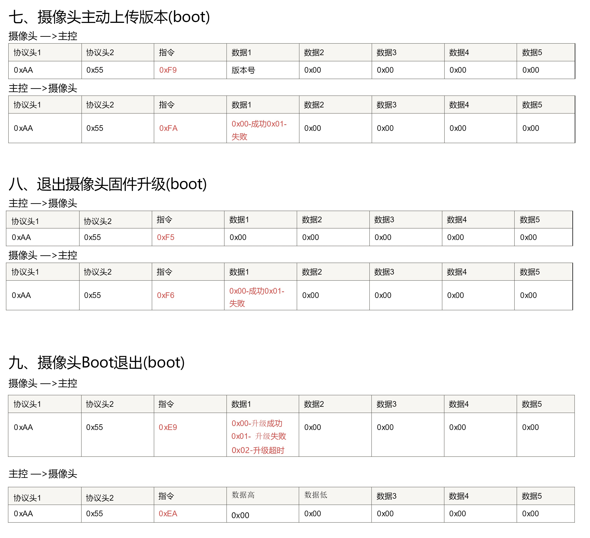

# BOOT USB CDC OTA 使用手册

 - 当前SDK的CDC OTA逻辑在 boot 阶段进行，当前boot默认开启ota
 - 上位CDC OTA应用使用 python 编写，可在 PC 端运行，开发者可自定义修改
   - 路径：`host-tools/usb_cdc_ota/usb_cdc_ota.py`

## Platform

**Board：**
CV180ZB-WEVB-0008A

**Solution：**
smart_doorbell

**Project：**
turnkey_180xb

**Tool：**
host-tools/usb_cdc_ota/ota.7z

> [!NOTE]
> OTA.exe 需要放在固件同级目录，工具对 config.yaml进行flash分区配置解析

<br>

## 配置CDC OTA支持

OTA yaml配置文件路径：
 - solutions/cv181x_boot/package.yaml

需要开启的配置如下：
```shell
  # USB
  CONFIG_SUPPORT_USB_DC: 1
  CONFIG_USB_DWC2_PORT: 1
  CONFIG_USB_HS: 1
  CONFIG_USBD_CDC_ACM_UART: 1

  # UPGRADE
  CONFIG_SUPPORT_CDC_OTA: 1
```

- 配置完成后使用 `make cv181x_boot` 命令，编译生成支持CDC OTA的 **boot.bin**文件
  - **boot.bin**文件路径为`solutions/cv181x_boot`
- 将其重命名为 **boot** ，替换掉原本固件中的 **boot** 文件并进行烧录
- 正常编译流程默认会将`boards/cv180xb_qfn/bootimgs/boot`文件拷贝至升级固件`images`文件夹下，可使用新**boot**进行替换

<br>

## OTA 使用流程

  1. 应用层设置升级标志位
      - 当前标志位为 flash 最后 4k 的位置，该位置不可被其他分区占有
  2. 进入OTA模式
  3. 获取设备版本号
  4. 板端与上位OTA应用交互，确定升级固件总数据包数量
  5. 板端发送 MD5 数据校验码
  6. 上位应用发送板端 OTA 固件数据包
  7. 板端完成更新，上发当前版本号


### CDC固件升级

- 当前升级等待时间为 20s 超时后退出升级过程
- 升级工具解析yaml后在所在目录搜索固件，ota不建议升级boot分区，以防在该过程中断电导致boot分区损毁，无法再升级

#### 方法一

  1. 使用`ota_set_flag`命令设置升级标志位后会自动重启设备
  2. 重启后PC(window)运行 **OTA.exe**

运行参考日志如下
```shell
(cli-uart)# ota_set_flag

(cli-uart)# spinor: ID = a1 40 18
[UTIL_INFO](cvi_ota_flag_set_pthread) 64:  flash_id :668
 flash_size :8388608
 xip_addr :0
 sector_size :4096
 page_size :256
C.SCS/0/0.BS/NOR.PS.PE.BS.BE.J.upgrade_init start
[ctx_init:190]flash_size:8388608, page_size:256, sector_size:4096
[ctx_init:243]MAX_PACKET_SIZE:4096, local_version:0
[upgrade_init:649]upgrade ctx int done
[upgrade_init:657]start upgrade
[upgrade_init:658]compile time 15:52:07
=======usb reset==========
DevEnumSpeed:0
============ enum done ============
[run_state_machine:610]state:1, event:9, not found transform
[run_state_machine:610]state:1, event:9, not found transform
[run_state_machine:610]state:1, event:9, not found transform
```

#### 方法二

此方法仅需 usb 连接，使用 uvc 扩展单元实现

  1. 替换驱动




  2. PC(window)运行 **OTA.exe**
  3. 或者卸载设备时勾选删除驱动选项，
> [!NOTE]
> 升级完成后需要在设备管理器中找到设备并回退驱动后重启uvc才能正常出流，或者卸载设备时勾选删除驱动选项，完成驱动的更换后重启设备即可

运行参考日志如下
```shell
[E/USB] receive ota

(cli-uart)# spinor: ID = a1 40 18
[UTIL_INFO](cvi_ota_flag_set_pthread) 64:  flash_id :668
 flash_size :8388608
 xip_addr :0
 sector_size :4096
 page_size :256
C.SCS/0/0.BS/NOR.PS.PE.BS.BE.J.upgrade_init start
[ctx_init:190]flash_size:8388608, page_size:256, sector_size:4096
[ctx_init:243]MAX_PACKET_SIZE:4096, local_version:0
[upgrade_init:650]upgrade ctx int done
[upgrade_init:658]start upgrade
[upgrade_init:659]compile time 14:39:21
=======usb reset==========
DevEnumSpeed:0
============ enum done ============
[run_state_machine:611]state:1, event:9, not found transform
[run_state_machine:611]state:1, event:9, not found transform
[run_state_machine:611]state:1, event:9, not found transform
```
#### 升级LOG示例

出现上述 **LOG** 表示成功进入升级模式，升级LOG如下：

```shell
[run_state_machine:609]state:1， event:9， not found transform
[run_state_machine:609]state:1， event:9， not found transform
[upgrade_init:685]enter upgrade!
[upgrade_init:691]packet_num:1031， version:0
[upgrade_init:707]get md5!
recv md5: 0x59 0xd1 0xa7 0x53 0xc9 0x57 0xeb 0xfe 0x39 0x43 0x1b 0x67 0x6a 0xf0 0x6f 0x93
[action_data_trans:361]recv packet start...
[action_data_trans:415]recv packet done， use time:1225 ms
[action_data_trans:425]check md5 success
[upgrade_init:666]data update start!
[cvi_do_update:465]offset:0， size:0xc000
[cvi_do_update:482]flash erase size:49152， use time:441ms

[cvi_do_update:491]flash write use time:119ms

[cvi_do_update:465]offset:0xc000， size:0x20000
[cvi_do_update:482]flash erase size:131072， use time:921ms

[cvi_do_update:491]flash write use time:180ms

[cvi_do_update:465]offset:0x2c000， size:0x2000
[cvi_do_update:482]flash erase size:8192， use time:161ms

[cvi_do_update:491]flash write use time:19ms

[cvi_do_update:465]offset:0x2e000， size:0x4b0000
[cvi_do_update:482]flash erase size:4915200， use time:12053ms

[cvi_do_update:491]flash write use time:9878ms

[upgrade_init:671]data update done!
[action_upload_version:566]upload version(0) done
[upgrade_init:703]exit upgrade!
[upgrade_init:731]cdc acm deinit
[upgrade_init:735]exit upgrade
upgrade_init done
partition_flash_register， 98
_boot_flash_info_get， 39
info->base_addr:0x0
info->sector_size:0x1000
info->block_size:0x0
info->device_size:0x1000000
info->erase_size:0x1000
j 0x80040000
###YoC###[Jun 28 2024，18:30:43]
spinor: ID = 9d 60 18
linear mode
ViPipe:0，===SC2336P 1080P 30fps 10bit LINE Init OK!===
weak MISC_WaitVideoStep1
get_buffer_alig_64 tmp = 0x82131a50， addr = 0x82131a80
csi codec open success
[cviaudio][info] CviAud algo interface[Aud_AlgoInterface_ver20211202]
[cviaudio][info] CviAud  algo lib[CVITEK_AEC_Algo_20211202]
[cvi3aVersion:CVITEK_AEC_Algo_20211202]
```

<br>

## CDC 协议

开发者可根据以下协议说明自定义CDC OTA升级





