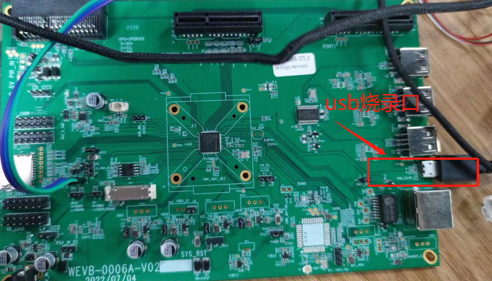
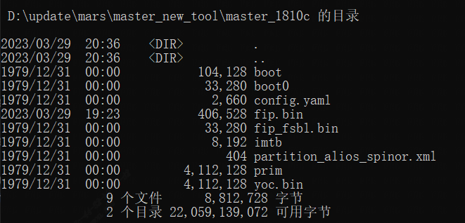
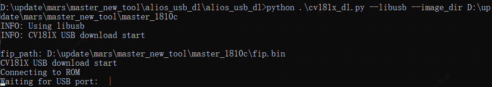
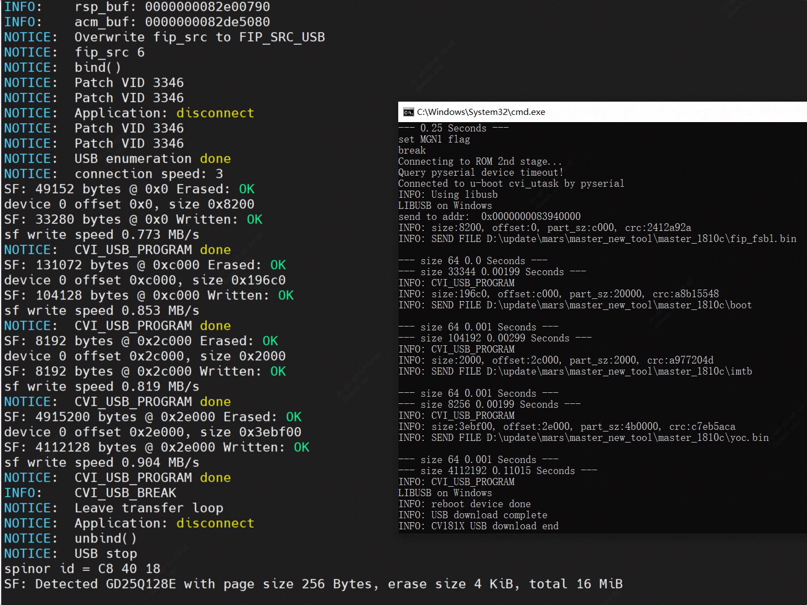
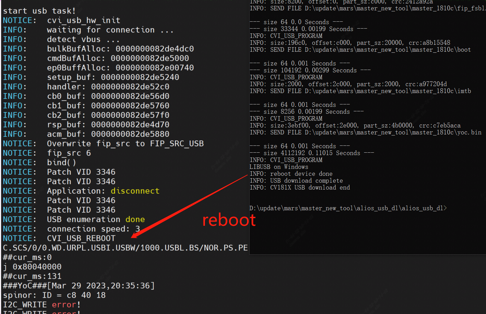
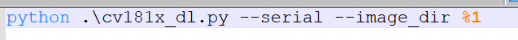

# CVI AliOS USB Burn

## 烧录工具及镜像准备
- 拷贝alios_usb_dl到window端解压
  | Name | Path |
  | --- | --- |
  | cv181x | /boards/tools/common/alios_usb_dl.zip |
  | cv180xb | /boards/tools/common/alios_usb_dl_cv180x.zip |
- 拷贝[编译步骤](#编译步骤)中生成的镜像文件以及fip.bin至windows端

## USB操作示例
- 移除平台DC供电并拔掉PC上的USB端口（以CV1810c_wevb_0006a_spinor为例）
  
- window端准备好烧录的固件
  
  
- 启动cmd终端，进入usb 烧录脚本的目录下执行命令cv181x_dl.bat
  ```
  <firmware path> # cv181x_dl.bat D:\update\mars\master_new_tool\master_1810c
  ```
  
  
- 将USB port接上PC后,自动开始烧录
  
  
  
- 烧录完成，平台烧录完成时会自动重启然后进入系统
  
  

## USB烧录注意事项
- 使用USB刻录时，请使用USB供电，并确认移除DC供电
- 如果遇到脚本无法正常执行完成,可以用ctrl+c中断脚本,并将平台断电后,重新执行USB刻录
- 如果pid 0x1001装的是pyserial，则需要将alios_usb_dl\cv181x_dl.bat文件改为serial（默认发行使用libusb)
  
  
- 如果遇到插入usb到PC端显示”无法识别此设备”，则使用zadig软件重装libusb驱动,请参考[windows USB 驱动安装](#windows-usb驱动安装)
  

<br>

## windows USB驱动安装
### Zadig安装USB驱动
请参考 [CVI AliOS Zadig](docs/cvi_alios_zadig.md)
