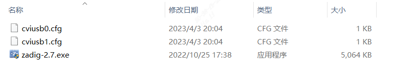
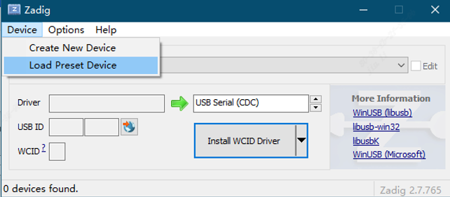
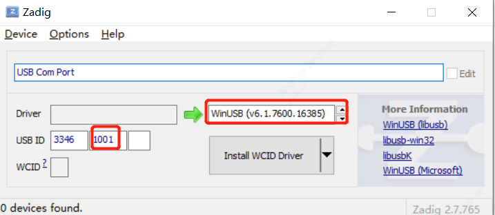
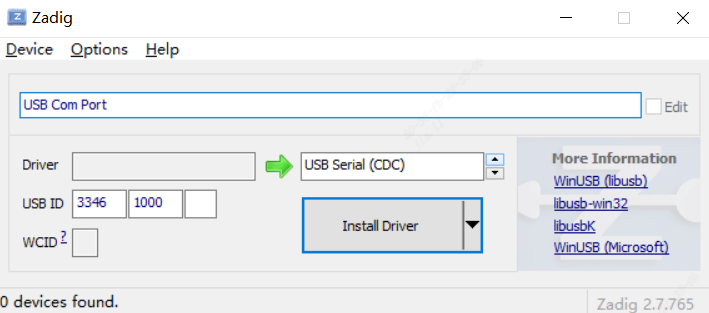
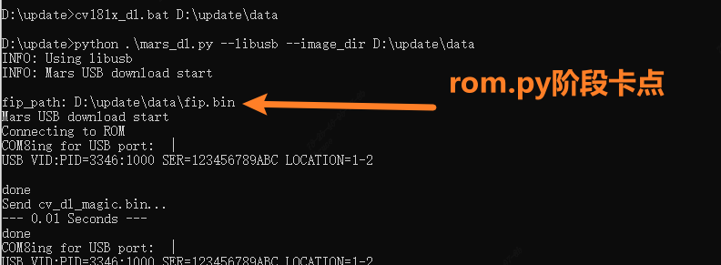
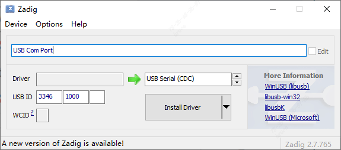
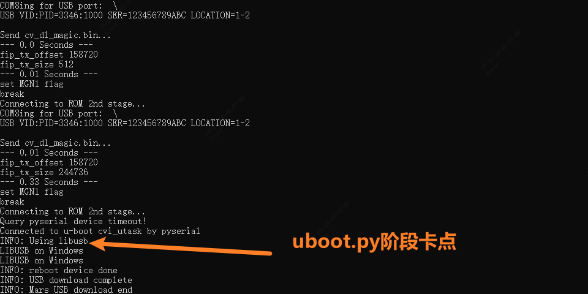
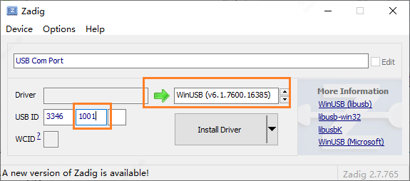
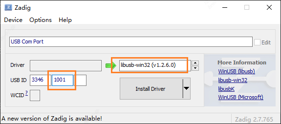

# CVI AliOS Zadig
## 使用Zadig安装USB驱动
1. 进入Zadig目录
  
   

2. 运行Zadig-2.7.exe
  
   

3. 点击Device->Load Preset Device选择cviusb1.cfg，安装驱动WinUSB
  
   

4. 如果是Windows7系统，则需多做一步：点击Device->Load Preset Device选择cviusb0.cfg，并安装驱动USB Serial CDC
   
   

 

## 注意事项
- 如果烧录过程中界面停留在下面红色标注阶段，则需要检查USB ID 3346 1000的usb驱动，确认是否要更新
  

操作方法1：参考[使用Zadig安装USB驱动](#使用zadig安装usb驱动)步骤（4）

操作方法2：
打开Zadig提前选择USB Serial(CDC), 板子上电瞬间，windows PC端检测到USB Com Port立即点击Install Driver，进行驱动安装。安装完成后进行USB烧录测试。
  

- 如果烧录过程中界面停留在下面红色标注阶段，则需检查USB ID 3346 1001的usb驱动，确认是否要更新
  

操作方法1：参考[使用Zadig安装USB驱动](#使用zadig安装usb驱动)步骤（3）

操作方法2：
打开Zadig选择WinUSB驱动，启动USB烧录流程，板子上电后进入uboot阶段检测到USB Com Port后点击Install Driver，进行驱动安装。驱动安装完成后进行USB烧录测试
  

如果即使安装了WinUSB也无法在uboot阶段升级固件，则尝试安装libusb-win32
  
