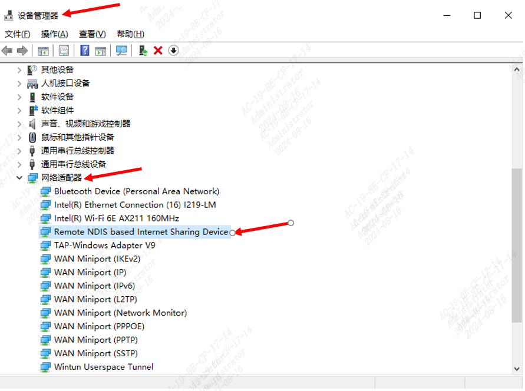
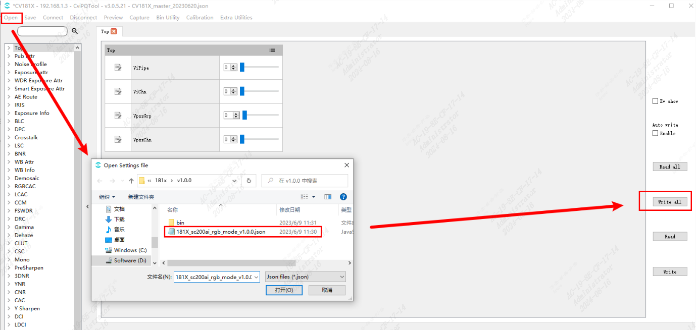
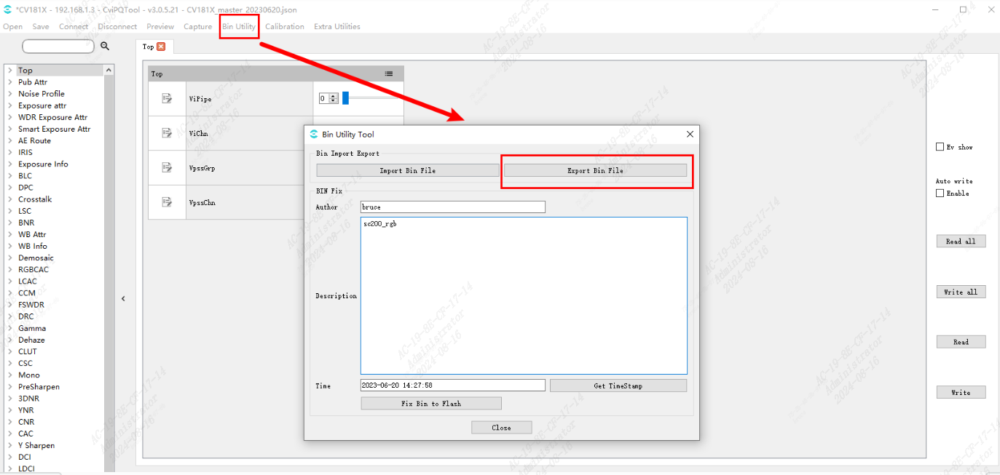
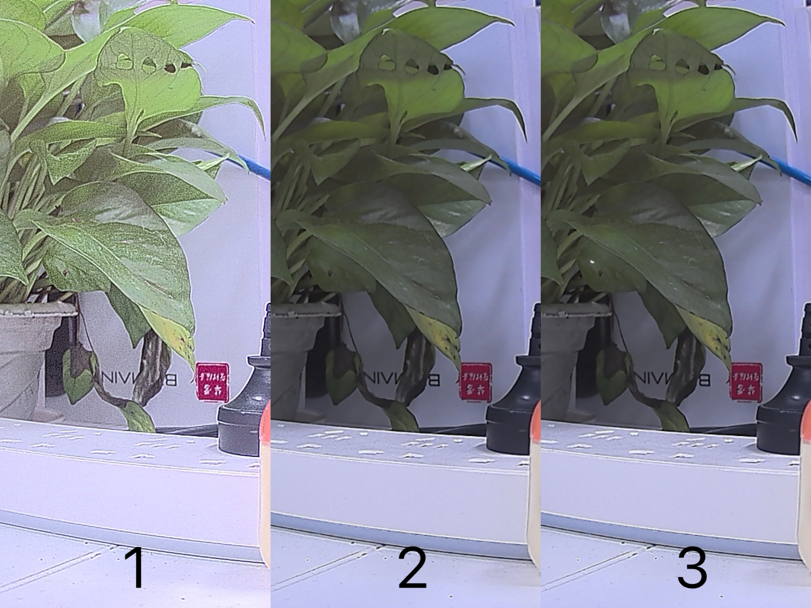

# PQtool 使用手册

- `Cvi PQtool` 是由算能开发的专业图像质量调试工具，在上位机通过网口将工具跟板端连接后，用户可在线调节 ISP 各模块的参数，同时还能实时确认参数修改后的图像效果变化
- 该手册用于 ISP 参数固化进 Alios 固件中的操作流程和基本功能使用参考
- ISP 参数可用于图像调试，提升图像质量与效果

> [!NOTE]
> 用户可参照 [_图像调优指南_](https://doc.sophgo.com/cvitek-develop-docs/master/docs_latest_release/CV180x_CV181x/zh/01.software/ISP/ISP_Tuning_Guide/build/html/index.html) 进行详细的 PQtool 图像调优

<br>

## YAML 文件配置

文件路径：`solutions/xxx/customization/xxx/xxx.yaml`

```yaml
# RNDIS网口使能
CONFIG_USBD_CDC_RNDIS: 1
# PQtool使能
CONFIG_PQTOOL_SUPPORT: 1
# UVC出流使能
CONFIG_USBD_UVC: 1
# 开启相关依赖
- cvi_mw_isp_com_raw_replay: develop
- cvi_mw_isp_com_raw_dump: develop
- cvi_mw_isp_daemon: develop
```

YAML 文件配置完成后，编译代码并进行固件的烧录更新
<br>

## 上位机网络配置

- 先检查网络适配器中的`Remote NDlS based Internet Sharing Device`是否处于开启状态，若有感叹号出现，则右击鼠标键，点击禁用设备，再点击启用设备。



- RNDIS 网络适配器配置流程可参考[UVC & RTSP 出流指南](docs/uvc_rtsp_streaming_manual.md)

> [!WARNING]
> 上位机的 IP 配置应与板端 RNDIS IP 在同一网段
>
> 如板端 RNDIS 默认 IP 为`192.168.11.10`，上位机可配置为`192.168.11.101` <br>

## PQtool 初始化

- 使用 usb 线连接 PC 和板端
- 打开 PQtool 工具
- 输入板端 IP Address
- 点击`Get Template From Board`获取板端 ISP 参数 TEMPLATE
- 点击`connect`与板端建立连接


<br>

## ISP 参数固化

本流程说明了如何将图像调优产生的 JSON 文件或.c 文件固化进 Alios 升级镜像

### json 文件加载

打开待加载的 json 文件，执行`write all`操作更新板端 ISP 参数配置，流程如下图所示



### ISP 参数客制化更新

用户可根据实际场景需求，自行调整 ISP 参数进行图像调优

### ISP 参数导出

导出 ISP 参数到.c 文件中，导出的文件包含 `default_param.h` 和 `default_param.c`

具体流程如下所示



### 源代码拷贝

将上一步生成的.c 文件拷贝到对应 Project 的 param 文件夹下，如路径：`solutions/xxx/customization/xxx/param`

param 目录结构如下所示，其中`ir_isp_param.c`和`rgb_isp_param.c`即 ISP 配置文件

```shell
.
├── custom_param.c
├── custom_sysparam.c
├── custom_vencparam.c
├── custom_viparam.c
├── custom_voparam.c
├── custom_vpssparam.c
├── ir_isp_param.c
└── rgb_isp_param.c
```

### Project ISP 参数配置

- 在 isp_param.c 文件中可更新数组名，并需要**添加 ISP 数组长度**
  ```c
  unsigned int cvi_rgb_pq_param_length = sizeof(cvi_rgb_pq_param);
  ```

- 打开 `solutions/xxx/customization/xxx/param` 下的 custom_viparam.c，做如下修改

  - 声明外部变量
    ```C
    extern unsigned char cvi_rgb_pq_param[];
    extern unsigned int cvi_rgb_pq_param_length;
    ```
  - 配置.astPQBinDes
    ```c
    .astPQBinDes[0] =
        {
            .pIspBinData = cvi_rgb_pq_param,
            .binID = CVI_BIN_ID_ISP0,
        },
    ```
  - 配置.u32IspBinDataLe
    ```c
    g_stViCtx.pstIspCfg[0].astPQBinDes[0].u32IspBinDataLen = cvi_rgb_pq_param_length;
    ```

- 上述步骤完成后，重新编译代码，生成固化了 ISP 参数的 Alios 升级镜像，可进行烧录升级

### 效果对比

- 图 1 为不加载 ISP 参数时通过 PQtool 捕获的图像
- 图 2 为加载 json 文件后通过 PQtool 捕获的图像，图像质量明显变好
- 图 3 为板端进行镜像烧录升级后，通过 PQtool 捕获的图像，效果与图 2 一致，则代表成功将参数固化进升级镜像



<br>
