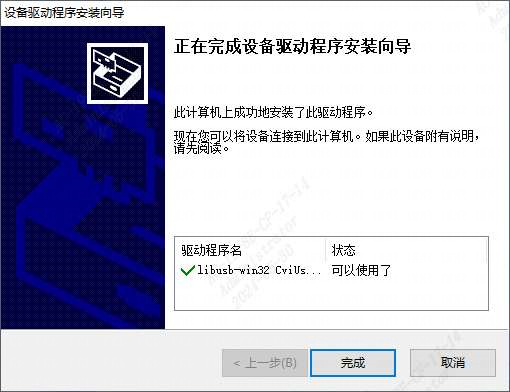
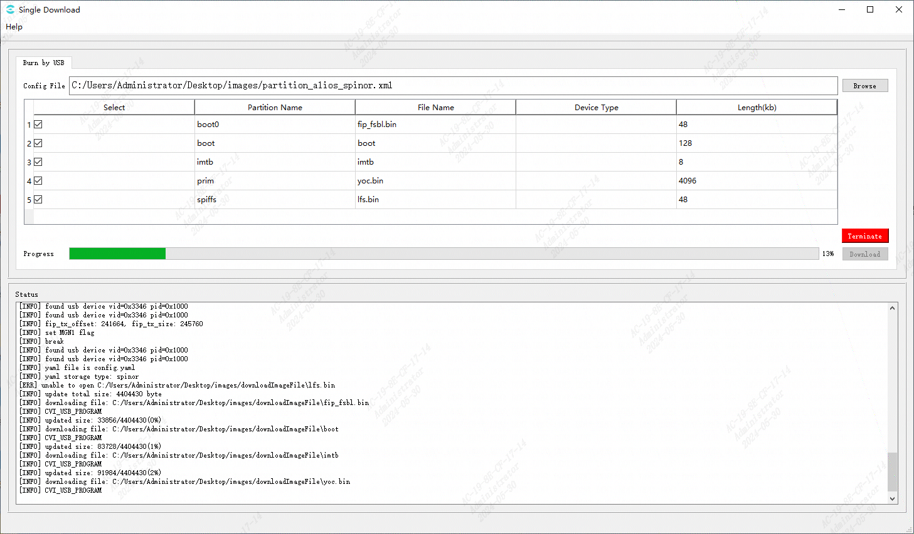

# CVI AliOS USB Burn

USB驱动安装应用及烧录应用路径：/host-tools/CviBurn_v2.0/

## USB 驱动安装

以 windows 10 系统下驱动安装为例

**Step 1**

解压 USB 驱动安装应用程序压缩包

**Step 2**

双击运行`CviUsbDownloadInstallDriver.exe`进行驱动安装，点选下一步直至安装完成



Windows 提供了 `pnputil` 命令行工具， 可用于管理设备驱动程序包

可以使用`pnputil /enum-drivers`命令列出所有第三方驱动程序信息，CviUsbDownload驱动信息如下：

```powershell
发布名称:       oem235.inf
原始名称:       cviusbdownload.inf
提供程序名称:   libusb-win32
类名:          libusb-win32 devices
类 GUID:       {eb781aaf-9c70-4523-a5df-642a87eca567}
驱动程序版本:   03/26/2024 1.0.0.0
签名者姓名:     libusb-win32 (CviUsbDownload.inf) [Self]
```

> [!NOTE]
> 请勿重复安装CviUsb驱动

<br>

## USB 驱动卸载
若对CviUsb驱动进行了重复安装或有卸载需求，可通过`pnputil`进行卸载


```powershell
PS C:\windows\system32> pnputil /delete-driver oem235.inf /uninstall
Microsoft PnP 工具

已卸载驱动程序包。
已成功删除驱动程序程序包。
```

> [!NOTE]
> 需要使用管理员权限打开命令行工具

<br>

## 烧录工具及升级固件准备

将对应处理器版本的`fip.bin`文件拷贝至编译生成的固件文件夹`images`中，fip.bin文件路径为：/boards/tools/fip

此时`images`包含如下文件：
```shell
.
├── boot
├── boot0
├── config.yaml
├── fip.bin
├── fip_fsbl.bin
├── imtb
├── prim
└── yoc.bin
```

<br>

## USB 烧录操作示例
### 命令行形式

启动命令行终端，进入 USB 烧录可执行应用的目录下开始固件升级
```powershell
 .\usb_dl.exe -c cv181x -s alios -i images_path
```

烧录日志如下所示：
```powershell
[INFO] Using libusb v1.0.26.11724[INFO] usb_dl: May 25 2024

[INFO] Waiting for USB device connection: ---
[INFO] found usb device vid=0x3346 pid=0x1000
[INFO] Waiting for USB device connection: ---
[INFO] found usb device vid=0x3346 pid=0x1000
[INFO] USB download start...
......
[INFO] Waiting for USB device connection:  \
[INFO] found usb device vid=0x3346 pid=0x1000
[INFO] yaml file is config.yaml
[INFO] yaml storage type: spinor
[INFO] update total size: 4404430 byte
[INFO] downloading file: images_path\fip_fsbl.bin
[INFO] CVI_USB_PROGRAM
[INFO] updated size: 33856/4404430(0%)
[INFO] downloading file: images_path\boot
[INFO] CVI_USB_PROGRAM
......
[INFO] USB download complete
```

> [!NOTE]
> 可通过`.\usb_dl.exe --help`查看命令行参数具体描述
>

### UI形式
> 若有使用USB图形烧录工具的需求，请和对接的技术支持联系

- 移除平台 DC 供电并拔掉 PC 上的 USB 端口
- 准备好烧录固件
- 配置CviUsb烧录工具参数
  - 参数配置文件路径：config/Board_config.ini
  - 配置处理器规格为`cv181x`或`cv180x`
  - 配置系统类型为alios
- 执行`cvi_combine.exe`应用
- 选择一拖一或一拖多烧录模式（下述步骤为一拖一模式）
- 点击`Browse`按钮选择升级固件
    > 加载images目录下的.xml文件，实际flash分区配置依照`config.yaml`文件进行
- 点击`Download`按钮进行固件烧录
- 将板端 USB port 连接 PC 后，自动开始烧录
- 平台烧录完成后会自动重启



<br>

## USB 烧录注意事项

- 使用 USB 烧录方式进行固件升级时，请使用 USB 供电，并确认移除 DC 供电
- 如果遇到脚本无法正常执行完成,可以用 ctrl+c 中断脚本,并将平台断电后,重新进行烧录
- 更多USB烧录工具信息请参考[_CVI 量产烧写指南_](https://doc.sophgo.com/cvitek-develop-docs/master/docs_latest_release/CV180x_CV181x/zh/01.software/BSP/Production_Burning_User_Guide/build/html/index.html)

<br>
