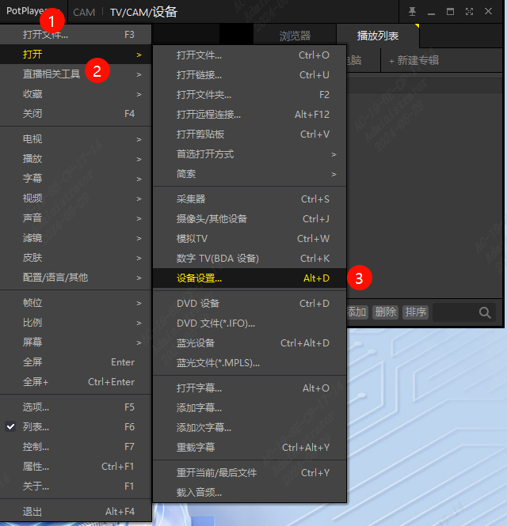
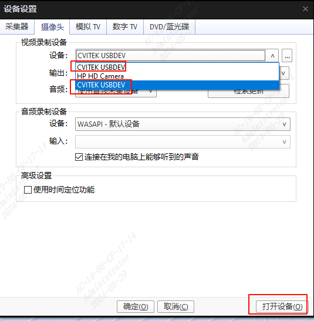
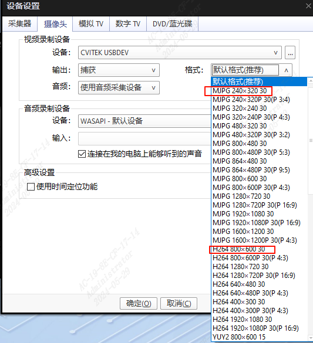
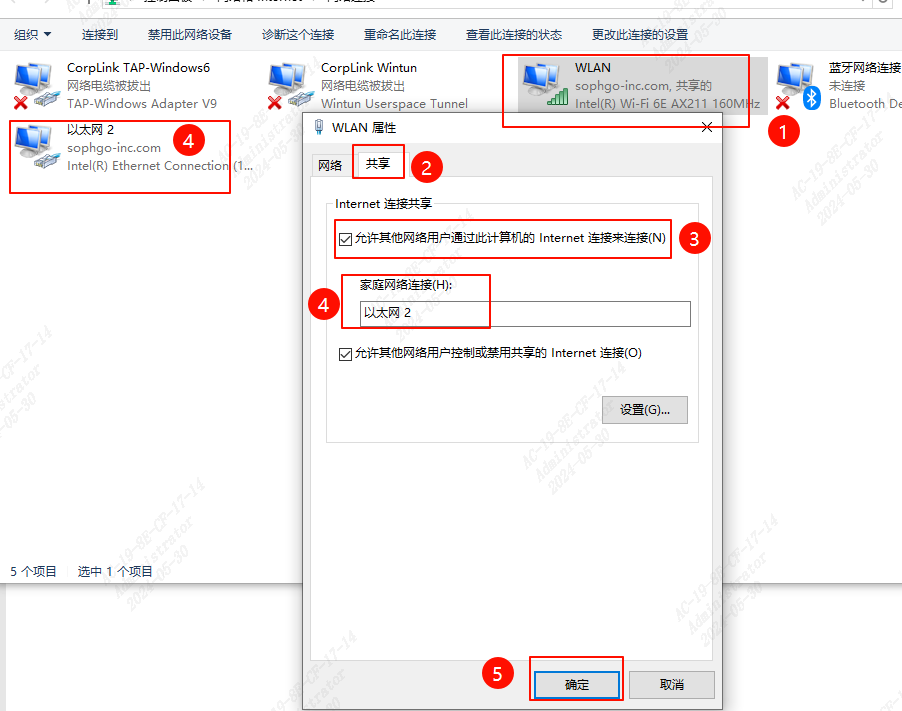
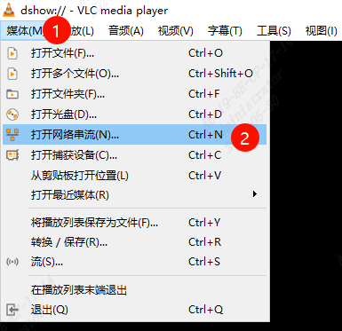
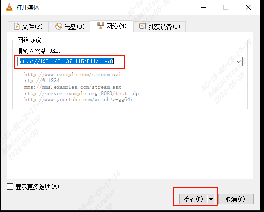
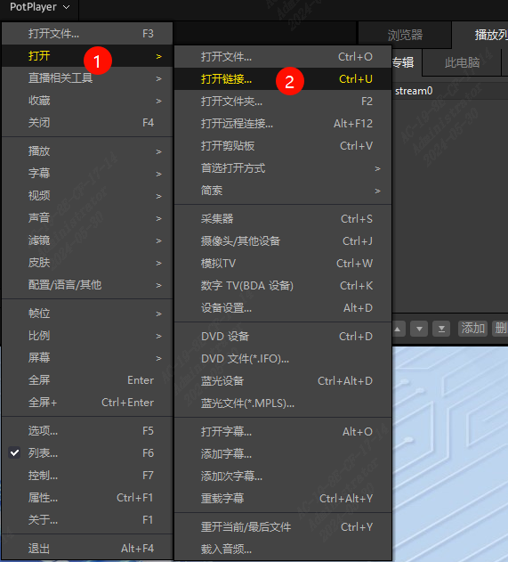
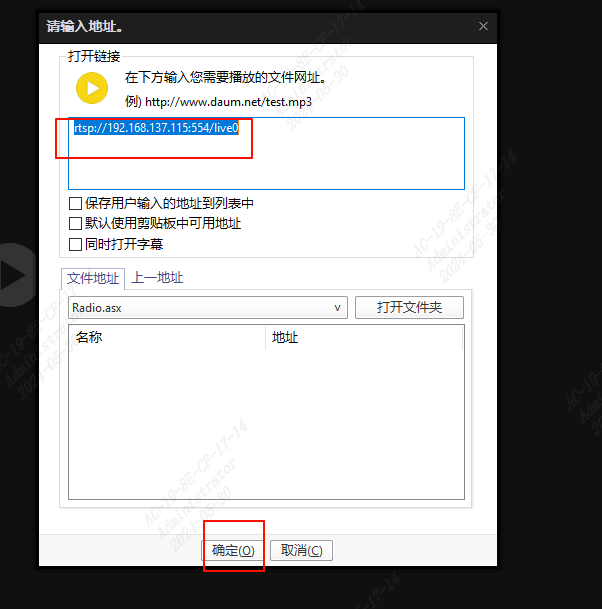
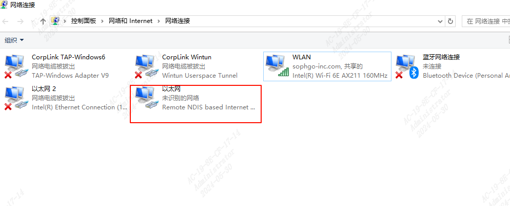
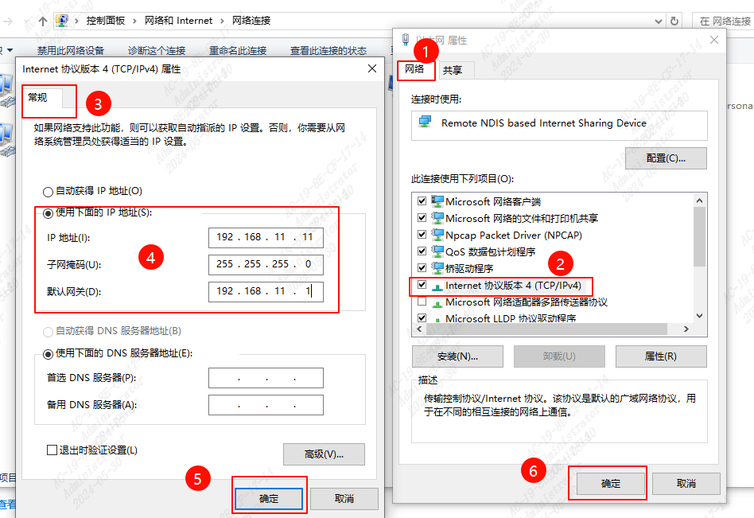

# UVC & RTSP Streaming

- 该方案作为 CV181X 处理器双目 sensor RGB+IR UVC 和 RTSP 出流参考
- 用户可结合场景使用需求进行自定义功能配置
- 此示例用到`Potplayer`和`VLC`这两款工具

## Platform

**Board**

CV1810C-WEVB-0006A

> [!WARNING]
> 需对 EVB 进行改板，修改处理器 MIPI 引脚相关电阻以支持双目出流

**Sensor**

WEDB-0022A-V01(GC2053 + GC2093)

> RNDIS 功能基于 FIFO 实现，与 DMA 功能不兼容
>
> RTSP 功能基于 IP 网络与上位机通信，依赖于 RNDIS 或 Ethernet

<br>

## UVC 出流

### UVC Param Config

**usbd_uvc.h**

UVC 默认配置是单 UVC 节点出流，若需支持两个 UVC 节点出流，需修改相关配置

文件路径：cvi_alios_open/components/cvi_platform/protocol/usb_devices/usbd_class/usbd_uvc/include/usbd_uvc.h

```C
#define USBD_UVC_NUM    2
```

**turnkey_qfn/param**

turnkey_qfn/param 的参数配置可参考[《\[SmartDoorbell\] turnkey_qfn》]([smdb]turnkey_qfn.md)

**package.turnkey_qfn.yaml**

turnkey_qfn/src/package.turnkey_qfn.yaml 需要打开的宏如下:

```yaml
CONFIG_USB_DWC2_DMA_ENABLE: 1
CONFIG_USBD_UVC: 1
```

<br>

### Potplayer UVC 出流

- PC 端连接上设备后，Potplayer 操作步骤如下所示

  

  

  > UVC 设备名可于 usbd_comp.c 修改

<br>

- UVC 出流格式切换

  

<br>

## RTSP 出流

### RTSP Param Config

**turnkey_qfn/param**

turnkey_qfn/param 的参数配置可参考[《\[SmartDoorbell\] turnkey_qfn》]([smdb]turnkey_qfn.md)

**package.turnkey_qfn.yaml**

RTSP 功能基于 IP 网络与上位机通信，依赖于 RNDIS 或 Ethernet，Ethernet 和 RNDIS 两者只能选其一

```yaml
CONFIG_APP_RTSP_SUPPORT: 1
```

### Ethernet

- yaml 文件配置

  ```yaml
  CONFIG_APP_ETHERNET_SUPPORT: 1
  ```

#### PC 端网络配置

> 此实例是 pc 端和板端用网线连接后

- 网络适配器配置方式如下：

  1. 打开所连的 wlan，右键点击属性.

  2. 点击共享栏

  3. 勾选允许其他网络用户通过此计算机的 Internet 连接来连接，

  4. 板端网络适配器为以太网 2，所以家庭网络连接配置选取以太网 2

  5. 点击确定

     

- 重新上电后，板端串口日志如下：
  ```shell
  rtsp://192.168.1.3:544/live0
  rtsp://192.168.1.3:544/live1
  rtsp Change ip : 192.168.137.115（此为示例 ip）
  ```

> [!NOTE]
> 用户也可配置静态 IP 进行连接

<br>

#### 基于 Ethernet 的 VLC RTSP 出流

- 打开设备

  

- 输入网络 URL

  

#### 基于 Ethernet 的 Potplayer RTSP 出流

- 打开设备

  

- 输入网络 URL

  

<br>

### RNDIS

- yaml 文件配置

  ```yaml
  CONFIG_USBD_CDC_RNDIS: 1
  ```

- RNDIS 网络适配器配置流程如下：

  
  

- 重新上电后，板端串口日志如下：
  ```shell
  rtsp://192.168.11.10:544/live0
  rtsp://192.168.11.10:544/live1
  ```

> [!NOTE]
> 除 IP 配置不同外，VLC 和 potplayer 两款软件出流操作均和基于 Ethernet 的 RTSP 出流相同
